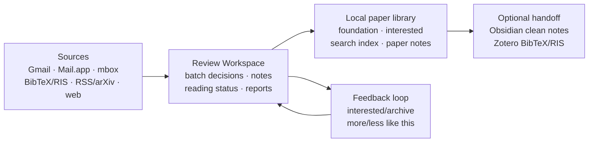
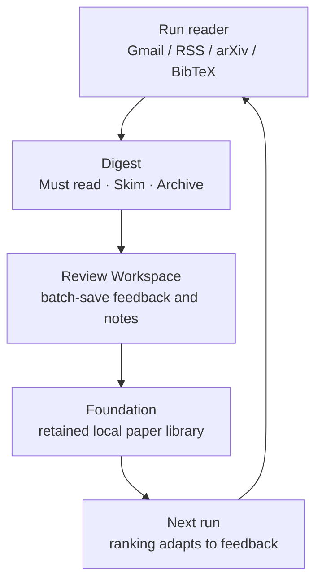
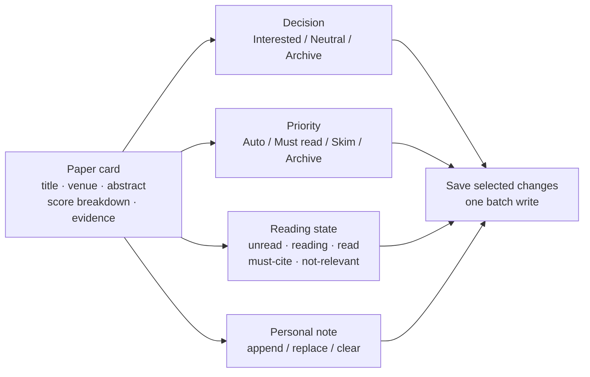
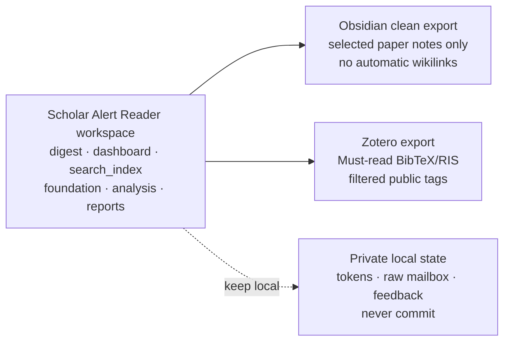
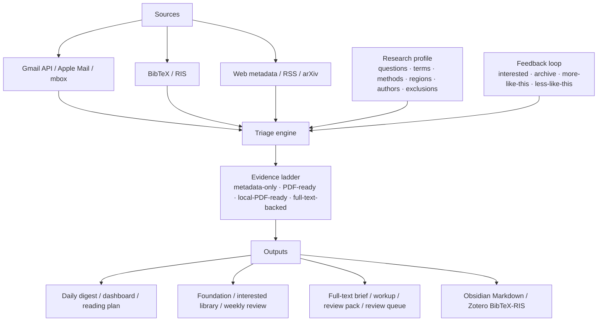

# Scholar Alert Reader Skill

Local, privacy-first literature triage and lightweight paper-library builder.

This project converts multiple paper discovery sources into a deduped, ranked, and explainable reading queue, then stores outcomes in a local library.

Version: `0.2.89`

Created by [Xin Liu](https://github.com/RunningXinLiu).

## 中文用户入口

这个项目主要适合每天需要跟踪 Google Scholar Alert、RSS/arXiv、BibTeX/RIS 或网页论文来源的科研用户。它会在本地完成论文解析、去重、可解释打分、Review Workspace 交互筛选、foundation 文献库沉淀，并可选导出到 Obsidian 和 Zotero。

如果你用 Codex，最省心的方式是直接让 Codex 帮你配置和运行：

```text
使用 scholar-alert-reader skill，帮我初始化项目、配置 Gmail 授权、建立第一次 foundation，并打开 Review Workspace。
```

中文资料：

- [中文用户手册（带图总览）](docs/user_manual.zh.md)
- [中文用户手册 HTML](docs/user_manual.zh.html)
- [中文用户手册 PDF](docs/user_manual.zh.pdf)
- [Gmail 授权中文指南](docs/gmail_auth_guide.zh.md)
- [中文手动使用流程](docs/manual_setup_no_ai.zh.md)
- [Obsidian clean/full 导出指南](docs/obsidian_export_guide.zh.md)

中文图片和动图已经放在仓库里，适合介绍或分享：

- [中文产品卡片](docs/assets/social-card.zh.png)
- [中文工作流动图](docs/assets/workflow.zh.gif)
- [中文架构图](docs/assets/architecture-showcase.zh.png)
- [Obsidian clean/full 边界图](docs/assets/obsidian-mode-decision.zh.png)
- [中文手册预览图](docs/user_manual.zh.preview.png)
- [功能截图目录](docs/screenshots)

## Product Boundary (v2)

### Standalone mode (required)

No Obsidian/Zotero needed.

- Multi-source ingestion: Gmail, Mail.app, `.mbox`, BibTeX/RIS, web pages, RSS/Atom, arXiv.
- Local paper metadata normalization, deduplication, scoring, rank explanation, and daily/manual digest.
- Reading state and labels: `unread`, `reading`, `read`, `must-cite`, `archive`, `background-only`, `not-relevant`.
- Export artifacts: markdown digest, JSONL/CSV, lightweight local `knowledge_base`.

### Integrated mode (optional)

Obsidian/Zotero are optional downstream sinks.

- Obsidian: exported Markdown paper notes (`clean` by default, `full` only when explicitly requested).
- Zotero: BibTeX/RIS exports and retained-paper sync.

These tools are sinks only; they are not required for core triage.

> Experiment scope is still a local triage stack. `deep-read`, `workup`, `advice`, and related workflows are metadata-first and should be treated as planning aids, not final scholarly conclusions.

## Start Here

> This README now includes inline image previews plus link-based fallback tables. If your network blocks `raw.githubusercontent.com`, use the direct asset links under [docs/assets](docs/assets) and [docs/screenshots](docs/screenshots).

Scholar Alert Reader works as a normal local Python CLI. Codex is the most guided entry point, but it is not required.

If you are a Codex user, install the skill and then talk to Codex in plain language:

```bash
mkdir -p ~/.codex/skills
git clone https://github.com/RunningXinLiu/scholar-alert-reader-skill.git \
  ~/.codex/skills/scholar-alert-reader
```

Restart Codex or reload skills, then ask:

```text
Use the scholar-alert-reader skill to initialize a Scholar Alert project for me.
```

Good next prompts:

- "Explain what this tool can and cannot do before I connect my data."
- "Check whether my Gmail/Mail.app/mbox/BibTeX/RIS/web/RSS/arXiv source is ready."
- "Run the setup wizard and configure my source/profile/schedule."
- "Run the profile wizard and turn my current research questions into a ranking profile."
- "Run the profile doctor and tell me whether my ranking profile is too broad or too sparse."
- "Run semantic rerank and show me papers that exact keywords may have missed."
- "Build my first foundation from existing Scholar Alert emails."
- "Run today's new-paper digest."
- "Import this Zotero or publisher BibTeX/RIS export into the same triage flow."
- "Import papers from this scholarly webpage or saved HTML list."
- "Pull papers from this RSS feed or arXiv query and rank them against my profile."
- "Open the Review Workspace so I can mark interested papers."
- "Open my Scholar Alert dashboard so I can see the digest, reading plan, review queue, and setup status."
- "Make a reading plan from my retained and recent papers."
- "Export my retained library to Obsidian and Zotero."

Optional/experimental follow-up prompts:

- "Deep-read this paper against my foundation."
- "Fetch the open PDF for this paper and build a full-text brief."
- "Make a workup for this paper and tell me whether it is worth reading or citing."
- "Ask my current retained library about this question: <research question>."
- "Generate a research map for retained papers in my interest area."

The skill works without Obsidian or Zotero. Those are optional upgrades for people who want a larger personal knowledge system.

## 3-Minute Standalone Demo

Run a local end-to-end demo without Gmail, Obsidian, or Zotero:

```bash
git clone https://github.com/RunningXinLiu/scholar-alert-reader-skill.git
cd scholar-alert-reader-skill
python3 -m scholar_alert_reader init-project \
  --project-dir ~/scholar_alerts_demo \
  --profile-template seismic-imaging

cd ~/scholar_alerts_demo
RSS_SOURCE=examples/sample_feed.atom ./rss_import.sh
```

The `rss_import.sh` run performs ingest + rank + digest + lightweight local library update.
The initialized demo project already contains `examples/sample_feed.atom`, so this path does not require Gmail OAuth, private mailbox exports, or private bibliography data.

Open the interactive Review Workspace first:

```bash
PAPERS_JSON=reader_out/rss/papers.json ./serve_reader.sh
```

Review Workspace language:

```bash
UI_LANGUAGE=en ./serve_reader.sh
UI_LANGUAGE=zh-CN ./serve_reader.sh
python3 -m scholar_alert_reader serve --profile profiles/research_profile.json --papers-json reader_out/rss/papers.json --language zh-CN --open
```

The public default is English. Chinese users can set `UI_LANGUAGE=zh-CN` for a fully Chinese Review Workspace. The ranking explanations follow the profile's `language` field, so use `"language": "zh-CN"` in a Chinese research profile and `"language": "en"` in an English one.

Then inspect the static outputs:

```bash
open reader_out/rss/digest.html
open knowledge_base/index.html
python3 -m json.tool knowledge_base/search_index.json | sed -n '1,80p'
ls knowledge_base/papers | head
```

First expected outputs:

- Review Workspace: browser UI for paper titles, source links, score explanations, feedback, notes, and reading status.
- `reader_out/rss/digest.html`: static ranked reading digest for archive/export.
- `knowledge_base/index.html`: lightweight local paper-library homepage.
- `knowledge_base/search_index.json`: machine-readable records for filtering/search.
- `knowledge_base/papers/*.md`: one per-paper note with metadata and score rationale.

If you are not on macOS, replace `open` with your platform equivalent (`xdg-open`, `start`, etc.).

## Visual Preview

This README uses GitHub-native Mermaid previews so the project homepage still renders on networks where GitHub's raw image host is blocked.

### Core Flow



### Daily Review Loop



### Review Workspace Model



### Obsidian And Zotero Boundary



Raster marketing assets are still checked into the repo under `docs/assets/` and `docs/screenshots/` for social sharing and local viewing. If your GitHub session cannot display those files, clone the repo and open them locally.

## Manual Setup Without Codex Or Another AI Agent

You can run the core tool from any terminal or from any coding agent that can access local files and execute shell commands.

Full no-AI guides:

- [中文用户手册（带图总览）](docs/user_manual.zh.md)
- [中文用户手册 HTML](docs/user_manual.zh.html)
- [中文用户手册 PDF](docs/user_manual.zh.pdf)
- [Gmail 授权中文指南](docs/gmail_auth_guide.zh.md)
- [Manual setup without Codex or another AI agent](docs/manual_setup_no_ai.md)
- [中文手动使用流程](docs/manual_setup_no_ai.zh.md)

Minimal terminal path:

```bash
git clone https://github.com/RunningXinLiu/scholar-alert-reader-skill.git
cd scholar-alert-reader-skill
python3 scripts/scholar_reader.py init-project \
  --project-dir ~/scholar_alerts \
  --profile-template ai-seismology
cd ~/scholar_alerts
RSS_SOURCE=examples/sample_feed.atom ./rss_import.sh
PAPERS_JSON=reader_out/rss/papers.json ./serve_reader.sh
```

After the local Review Workspace is working, optional downstream handoff is just:

```bash
./sync_obsidian_vault.sh --obsidian-mode clean
./zotero_export.sh
```

`sync_obsidian_vault.sh` writes selected paper notes into a dedicated Obsidian literature inbox by default. `zotero_export.sh` writes Zotero-ready BibTeX/RIS under `knowledge_base/zotero/`.

Agent compatibility:

- **Claude Code**: supported through the Python CLI. This repo includes `CLAUDE.md` with Claude-specific operating notes.
- **Cursor, Windsurf, Gemini CLI, and similar local agents**: supported if they can run shell commands and read/write local files.
- **Claude Desktop or web chat**: can help interpret outputs, but needs a local tool/MCP/file bridge to run the workflow on your machine.
- **Plain terminal**: fully supported through `python3 -m scholar_alert_reader`, the installed `scholar-alert-reader` command, the compatibility wrapper at `scripts/scholar_reader.py`, and the generated project scripts.

What is agent-specific:

- `SKILL.md` is for Codex skill loading and guided operation.
- `CLAUDE.md` is for Claude Code orientation.
- The durable source of truth is the Python CLI plus local project files, not any one agent.

## Support And Safe Reporting

Use GitHub issues for bugs, source setup help, and feature requests. The issue forms are privacy-first: do not paste raw emails, OAuth credentials, Gmail tokens, private bibliography/feed lists, `seen_papers.json`, `feedback.json`, or generated knowledge-base content.

For public troubleshooting, run a local privacy check first, then generate a sanitized support bundle and review it before posting:

```bash
./privacy_check.sh --strict
./support_bundle.sh
# or
python3 -m scholar_alert_reader privacy-check --project-dir ~/scholar_alerts --strict
python3 -m scholar_alert_reader support-bundle --project-dir ~/scholar_alerts
```

`privacy-check` reports high-risk paths, review-before-sharing files, and recommended `.gitignore` gaps without including raw file contents.

The bundle summarizes versions, platform, config keys, file presence, counts, and sanitized `SOURCE_CHECK.md` / `DOCTOR.md` excerpts without including token contents, raw mailbox data, feedback contents, or generated knowledge-base text.

For credential leaks, raw mailbox exposure, or other security-sensitive problems, use [SECURITY.md](SECURITY.md) instead of a public issue.

## Screenshots

Sanitized demo screenshots are included for product previews and sharing. GitHub serves repository images through its raw image host, so some networks cannot display them on the website. Clone the repo or browse the folders locally if the file preview is blocked.

| Area | Local file |
|---|---|
| Daily digest with evidence badges | `docs/screenshots/01-daily-digest.png` |
| Review Workspace for batch feedback and notes | `docs/screenshots/02-feedback-triage.png` |
| Foundation and interested library | `docs/screenshots/03-foundation-interested.png` |
| Evidence-aware selected-paper workflow | `docs/screenshots/04-deep-read-copilot.png` |
| Research map and advice | `docs/screenshots/05-research-map-advice.png` |
| Clean Obsidian and Zotero handoff | `docs/screenshots/06-obsidian-zotero.png` |

## Visual Assets

| Purpose | English file | Chinese file |
|---|---|---|
| Social card | `docs/assets/social-card.en.png` | `docs/assets/social-card.zh.png` |
| Workflow GIF | `docs/assets/workflow.en.gif` | `docs/assets/workflow.zh.gif` |
| Architecture diagram | `docs/assets/architecture-showcase.en.png` | `docs/assets/architecture-showcase.zh.png` |
| Obsidian mode decision | `docs/assets/obsidian-mode-decision.en.png` | `docs/assets/obsidian-mode-decision.zh.png` |
| Obsidian directory boundary | `docs/assets/obsidian-boundary.en.png` | `docs/assets/obsidian-boundary.zh.png` |
| Obsidian migration flow | `docs/assets/obsidian-migration.en.png` | `docs/assets/obsidian-migration.zh.png` |
| Logo | `docs/assets/logo.png` | `docs/assets/logo.png` |

## What It Does

### Core (standalone, required)

- Connects to Gmail API, Apple Mail, exported `.mbox`, BibTeX/RIS files, structured scholarly webpages, RSS/Atom feeds, and arXiv queries.
- Monitors configured web sources such as publisher article pages, journal feeds, saved-search feeds, and arXiv queries without depending on a hosted service.
- Extracts paper title, author/source line, snippet, source label, and link, then deduplicates repeated papers across sources.
- Scores papers against your research profile: keywords, methods, regions, authors, exclusions, lightweight semantic queries, adaptive feedback similarity, and temporary boost terms.
- Explains why selected papers received their current score and tier, including matched terms, feedback status, thresholds, and tuning suggestions.
- Evaluates ranking quality against your interested/archive feedback, including precision/recall, average precision, false positives, and missed positives.
- Reranks saved papers with a local semantic layer so weak-keyword papers close to your profile or interested seeds can be inspected before you tune broad terms; the default backend is sparse and zero-dependency, and an optional local `sentence-transformers` backend is available for users who install it.
- Checks optional embedding readiness before a real embedding rerank, without loading models unless you pass `--load-model`.
- Produces daily or manual HTML/Markdown digests, CSV/JSON outputs, and a retained knowledge base.
- Labels each paper with its current evidence level, such as metadata-only, metadata-enriched, PDF-link-ready, local-PDF-ready, or full-text-backed, so users can tell when a report is based on snippets versus cached full text.
- Adds an `evidence` command and generated `evidence_reader.sh` helper so users can inspect one paper's evidence status, local artifacts, boundaries, and next upgrade commands before treating a report as citation-ready.
- Writes a local `DASHBOARD.html` home page that links the current digest, reading plan, review queue, analysis report index, source readiness summary, profile health, retained library, and setup diagnostics.
- Explains zero-paper runs in `summary.json`, `digest.md/html`, terminal output, and the Dashboard, separating all-seen daily runs from empty sources and parser/source metadata problems.
- Lets you edit paper feedback in batches across separate dimensions: decision (`Interested` / `Neutral` / `Archive`), priority override (`Auto` / `Must read` / `Skim` / `Archive`), learning signal (`More like this` / `Less like this`), reading status, report generation, and notes. Everything is written with one `Save selected changes` button.
- Includes a bundled-data `self-test` so new users can verify the install without touching private email or note libraries.
- Writes and opens a browser-friendly `START_HERE.html` onboarding guide alongside `START_HERE.md` with recommended next actions, a source setup matrix, and current readiness hints for Gmail, Mail.app, mbox, BibTeX/RIS, web metadata, RSS/Atom, and arXiv, including custom paths and direct web URLs from `reader.env`.
- Includes `privacy-check` so users can scan local projects for files that should not be published before sharing issue attachments, screenshots, or zip archives.
- Supports scheduled or manual runs through generated shell scripts, macOS LaunchAgent plists, Codex automations, or your own cron/system scheduler.
- Fetches explicit/open PDF URLs from user input, arXiv, structured webpage metadata, or OpenAlex metadata into local files before full-text extraction.
- Exports Zotero-ready BibTeX/RIS and Obsidian-ready Markdown notes. Obsidian defaults to `clean` note-only export so machine-generated dashboard/index files stay in the tool workspace unless explicitly requested.

### Experimental copilot layer (optional)

- Paper workspace questions and one-paper planning commands: `ask`, `compare`, `map`, `advice`.
- Paper investigation workflows: `deep-read`, `workup`, `review-pack`, `full-text`, and `review-workflow`.
- review and synthesis artifacts (`analysis/` reports) with explicit evidence boundary labels.
- These are planning/triage tools that should not replace full-text reading or manuscript writing.

## Capability Boundary

For a concise product-boundary report, run:

```bash
python3 -m scholar_alert_reader capabilities
python3 -m scholar_alert_reader evidence
# or inside an initialized project
./capabilities.sh
./evidence_reader.sh --paper-id <ID>
```

The core ranking layer is local and explainable: profile terms, methods, regions, watched authors, exclusions, semantic queries, temporary boosts, explicit feedback, adaptive similarity to retained/interested papers, and optional semantic reranking. `semantic-rerank` defaults to sparse TF-IDF with no extra dependencies; `--backend sentence-transformers` uses a user-installed local embedding model. It is not a hosted embedding service or autonomous reviewer.

`deep-read`, `workup`, `ask`, `compare`, `map`, and `advice` are optional experimental helpers. They can surface paper-level synthesis and planning signals from metadata/full-text cache context, but they are explicitly triage tools with an evidence boundary. For closer reading, provide local PDF/text paths directly or through Zotero, fetch an explicit/open PDF URL with `fetch-pdf`, run `review-workflow`, or use the lower-level `full-text`, `workup`, `review-pack`, and `review-queue` commands when you want more control.

## Product Modes

1. **Standalone** (default): works end-to-end with local files only.
   - Read and normalize from multiple sources.
   - Rank, explain, filter, and export a daily/local digest.
   - Keep local reading state and local library outputs.

2. **Integrated**:
   - Obsidian sync of selected generated paper notes (`clean` default).
   - Optional full Obsidian bundle (`--obsidian-mode full`) when you intentionally want generated dashboards/maps/report indexes inside the vault export.
   - Zotero export for citation/bibliography workflows.

Obsidian and Zotero are optional integrations, not hard dependencies.

More explicit boundaries are documented in:

- [docs/product_boundary.md](docs/product_boundary.md)
- [docs/architecture.md](docs/architecture.md)
- [docs/scoring_model.md](docs/scoring_model.md)
- [docs/obsidian_export_guide.en.md](docs/obsidian_export_guide.en.md)
- [docs/obsidian_export_guide.zh.md](docs/obsidian_export_guide.zh.md)

## Architecture

### Current Architecture

```text
ingest/* 
  -> ranking.scorer
  -> ranking.format
  -> library.store + library.render
  -> digest / search_index / exports
```

Core path above is standalone and required.

`copilot` (`deep-read`, `workup`, `map`, `advice`, etc.) is optional/experimental and not part of the core dependency path.



Chinese sharing assets are included under `docs/assets/*.zh.*`. Personal promotion copy, group-meeting decks, live private screenshots, and real user outputs should stay outside the public repository.

## Platform Support

- Gmail API source: macOS, Linux, and Windows, as long as Python can open the OAuth browser flow once and store the token.
- Exported `.mbox` source: macOS, Linux, and Windows.
- BibTeX/RIS source: macOS, Linux, and Windows. Useful when the user has Zotero, EndNote, publisher exports, Google Scholar library exports, or no Gmail access.
- Structured webpage metadata, RSS/Atom, and arXiv sources: macOS, Linux, and Windows. Useful for publisher article pages, journal feeds, saved-search feeds, and structured web monitoring without deep crawling.
- Mail.app source: macOS only, because it uses AppleScript and requires Automation permission.
- LaunchAgent scheduling: macOS only. Other platforms can use cron, systemd timers, or Task Scheduler around `run_reader.sh` / the Python CLI.
- Codex skill mode is the intended UX, but the Python CLI can also be run directly from this repository.

## Framework Layout

```text
scholar_alert_reader/
├── core.py        # CLI, source parsing/ranking pipeline, command wiring
├── ranking/       # scoring extraction layer (standalone)
├── models.py      # canonical data structures
├── copilot.py     # deep-read, workups, Q&A, advice, maps
├── diagnostics.py # setup checks
├── enrich.py      # OpenAlex/Crossref enrichment
├── export.py      # BibTeX/RIS/Markdown/JSONL exporters
├── server.py      # local browser Review Workspace
└── weekly.py      # weekly synthesis renderer
```

The package can run as `python3 -m scholar_alert_reader` or as an installed `scholar-alert-reader` command. The original `scripts/scholar_reader.py` path is kept as a compatibility wrapper, so existing automations can continue to call it.

## Install As A CLI

Run directly from a clone:

```bash
git clone https://github.com/RunningXinLiu/scholar-alert-reader-skill.git
cd scholar-alert-reader-skill
python3 -m scholar_alert_reader --version
python3 -m scholar_alert_reader quickstart --project-dir ~/scholar_alerts --open
```

Install from the checkout into your current Python environment:

```bash
python3 -m pip install .
scholar-alert-reader quickstart --project-dir ~/scholar_alerts --open
```

Install straight from GitHub:

```bash
python3 -m pip install "git+https://github.com/RunningXinLiu/scholar-alert-reader-skill.git"
scholar-reader quickstart --project-dir ~/scholar_alerts --open
```

If you plan to use Gmail API from an installed CLI, install the optional Gmail dependencies:

```bash
python3 -m pip install "scholar-alert-reader-skill[gmail] @ git+https://github.com/RunningXinLiu/scholar-alert-reader-skill.git"
```

If you plan to use the optional local embedding reranker, install the embedding extra from a checkout or install `sentence-transformers` in the same environment:

```bash
python3 -m pip install '.[embedding]'
```

Then verify the backend before using it in scheduled runs:

```bash
python3 -m scholar_alert_reader embedding-check \
  --backend sentence-transformers \
  --embedding-model sentence-transformers/all-MiniLM-L6-v2
```

Add `--load-model` only when you want to test actual model loading/cache behavior.

Initialized project scripts remember the Python used at setup time, prefer `PROJECT_DIR/.venv/bin/python` when it exists, and fall back to `python3 -m scholar_alert_reader` when the repository wrapper is not available.

## CodeGraph

CodeGraph is supported as a local structural index, but `.codegraph/` is generated state and is not the source of truth. Source code remains in `scholar_alert_reader/`, `scripts/`, and `tests/`. See [references/codegraph.md](references/codegraph.md).

## Install As A Codex Skill

Copy this folder into your Codex skills directory:

```bash
cp -R scholar-alert-reader-skill ~/.codex/skills/scholar-alert-reader
```

Then restart Codex or reload skills.

You can also install directly from GitHub:

```bash
mkdir -p ~/.codex/skills
git clone https://github.com/RunningXinLiu/scholar-alert-reader-skill.git \
  ~/.codex/skills/scholar-alert-reader
```

After that, Codex can read `SKILL.md` and guide the user through setup, source checks, Gmail OAuth, daily runs, feedback, and optional Obsidian/Zotero exports. Optional experimental copilot reports are covered later in this README.

## Gmail API Setup

中文用户建议先看：[Gmail 授权中文指南](docs/gmail_auth_guide.zh.md)。Codex 可以帮你检查依赖、启动 OAuth 授权、跑 Gmail source check；你只需要自己在 Google Cloud 创建 `Desktop app` OAuth client，并在浏览器里确认授权。

Install dependencies in your preferred Python environment:

```bash
python3 -m pip install -r requirements-gmail.txt
```

Create a Google Cloud OAuth client with application type `Desktop app`, download the JSON, and save it as:

```text
~/.codex/scholar-alert-reader/gmail_credentials.json
```

Authorize Gmail:

```bash
python3 -m scholar_alert_reader auth-gmail \
  --gmail-credentials ~/.codex/scholar-alert-reader/gmail_credentials.json \
  --gmail-token ~/.codex/scholar-alert-reader/gmail_token.json
```

Gmail OAuth distribution model:

- Do not ship your own OAuth client JSON in this repository.
- For private or small-team use, each user should create their own Google Cloud Desktop OAuth client and add themselves as a test user when needed.
- For a public hosted/shared app, the app owner must handle Google OAuth verification before broad distribution.
- The skill requests Gmail read-only access: `https://www.googleapis.com/auth/gmail.readonly`.

## Quick Start

Create a runnable local project:

```bash
python3 -m scholar_alert_reader quickstart --project-dir ~/scholar_alerts --open
cd ~/scholar_alerts
```

`quickstart` creates the project, runs private-data-free checks and demos, and writes `QUICKSTART_REPORT.md` plus `QUICKSTART_REPORT.html` with clickable local links, local source recommendations, and copy-paste next commands. To do the steps manually instead:

The generated `START_HERE.html` includes recommended next actions and a source setup matrix with local readiness hints. Pick one source, follow its prepare/check/run commands, and run a live source check before scheduling automation. Add `--open` to `guide` when you want to write and open the browser guide in one command.

```bash
python3 -m scholar_alert_reader init-project --project-dir ~/scholar_alerts
cd ~/scholar_alerts
```

Run the bundled-data self-test. It does not read Gmail, Mail.app, Zotero, Obsidian, or any personal files:

```bash
./self_test.sh
```

Read the capability boundary before connecting private data:

```bash
./capabilities.sh
./privacy_check.sh
```

Open the generated onboarding guide:

```bash
open START_HERE.html
cat START_HERE.md
./guide_reader.sh
./dashboard_reader.sh --open
```

Try the built-in demo without Gmail, Obsidian, or Zotero:

```bash
./demo_reader.sh
./demo_sources.sh
./source_check.sh --source auto
PAPERS_JSON=reader_out/demo/papers.json ./serve_reader.sh
```

`demo_sources.sh` runs sanitized examples for mbox, BibTeX, RIS, webpage metadata, and RSS into `reader_out/demo_sources/`.

Persist your local defaults:

```bash
./setup_wizard.sh
```

Or configure non-interactively:

```bash
./setup_reader.sh \
  --source auto \
  --profile-template ai-seismology \
  --schedule-time 09:00 \
  --schedule-days weekdays
```

Both setup paths write `reader.env`, which is automatically read by generated helper scripts. Explicit one-off command variables still win, so `SOURCE=mbox ./run_reader.sh`, `WEB_SOURCE=... ./web_import.sh`, or `RSS_SOURCE=... ./rss_import.sh` can override the saved defaults.

The wizard also writes `SOURCE_CHECK.md` after configuration. Add `--live-check` when you want it to attempt a real Gmail, mbox, bibliography, web, RSS, or arXiv read immediately. The report includes source-specific next steps for OAuth, Mail.app permissions, mbox placement, BibTeX/RIS exports, web source lists, RSS feed lists, and arXiv queries.

Render or install the local schedule:

```bash
./schedule_reader.sh --action write
./schedule_reader.sh --action install
./schedule_reader.sh --action status
```

`schedule_reader.sh --action write` creates `SCHEDULE.md` plus a LaunchAgent plist under `LaunchAgents/` without touching macOS scheduling. The schedule report now includes a Source Readiness Gate summary from `SOURCE_CHECK.md`, so you can see whether the configured source was checked live before installing automation. On macOS, `--action install` writes the plist to `~/Library/LaunchAgents/` and loads it with `launchctl` only after the latest source check shows a live `OK` result; run `./source_check.sh --source auto --live` first, or pass `--skip-source-check` only when you intentionally want to install despite a warning. `--action uninstall` removes the LaunchAgent. Other platforms can use the generated report and `run_reader.sh` with cron, systemd timers, or Task Scheduler.

Choose a starting research profile:

```bash
python3 -m scholar_alert_reader list-profile-templates
python3 -m scholar_alert_reader list-profile-templates --format markdown
./copy_profile_template.sh --template ai-seismology --force
./profile_wizard.sh
./profile_doctor.sh
```

Bundled templates include:

- `general-geophysics`: broad seismology/geophysics triage.
- `ai-seismology`: foundation models, phase picking, association, relocation, continuous waveform learning, and benchmarks.
- `induced-seismicity`: injection-induced seismicity, microseismic monitoring, mechanisms, hazards, and case comparison.
- `seismic-imaging`: surface waves, ambient noise, receiver functions, anisotropy, FWI, and inversion uncertainty.
- `dense-array-monitoring`: dense arrays, DAS, urban monitoring, continuous detection, and array processing.

The template is only the starting point. Use `./profile_wizard.sh` to add your own current questions, regions, authors, methods, exclusions, and semantic queries without editing JSON by hand:

```bash
./profile_wizard.sh \
  --focus "surface wave tomography, ambient noise, seismic foundation model" \
  --method "uncertainty quantification, phase picking" \
  --region "Tibet, Sichuan Basin" \
  --question "Which new papers are worth reading for my current manuscript?"
```

You can still edit `profiles/research_profile.json` directly when you want full control over adaptive ranking settings, tier thresholds, and temporary boost terms.

If you want a plain editable starter outside generated projects, copy:

- `examples/research_profile.example.json`
- `examples/research_profile.seismology.json`

After editing or after a few days of feedback, run:

```bash
./profile_doctor.sh
```

It writes `profiles/profile_doctor.md` with checks for sparse profiles, overly broad high-weight terms, missing semantic queries, missing exclusions, overlapping thresholds, feedback history, and recent/library ranking behavior.

`semantic_queries` are short natural-language descriptions of things you care about. They use local token-overlap matching, not a hosted embedding service, so they can rescue papers whose wording differs from your exact keywords while keeping the score explainable.

`adaptive_ranking` is the feedback loop. After you mark papers as `interested`, `more-like-this`, `archive`, `less-like-this`, `reading`, `must-cite`, or `method-reference`, later runs compare new papers with those local seeds. Similar papers get a small boost; papers similar to archived seeds get a penalty. This is local and explainable, not an embedding service.

Run daily triage:

```bash
./run_reader.sh
```

Import from BibTeX or RIS without Gmail:

```bash
cp ~/Downloads/my_papers.bib import.bib
./bibtex_import.sh
PAPERS_JSON=reader_out/bibtex/papers.json ./serve_reader.sh
```

```bash
cp ~/Downloads/my_papers.ris import.ris
./ris_import.sh
PAPERS_JSON=reader_out/ris/papers.json ./serve_reader.sh
```

You can also test the import route with sanitized examples:

```bash
BIBTEX_PATH=examples/sample_import.bib ./bibtex_import.sh
RIS_PATH=examples/sample_import.ris ./ris_import.sh
```

Import from structured scholarly webpages, RSS/Atom, or arXiv:

```bash
WEB_SOURCE=examples/sample_web_article.html ./web_import.sh
PAPERS_JSON=reader_out/web/papers.json ./serve_reader.sh
```

```bash
WEB_SOURCE=examples/web_sources.example.txt ./web_import.sh
PAPERS_JSON=reader_out/web/papers.json ./serve_reader.sh
```

The webpage importer reads common scholarly metadata from configured URLs or saved HTML files: citation meta tags, JSON-LD, Dublin Core, and OpenGraph. It is meant for article pages and saved search pages with structured metadata, not arbitrary full-site crawling.

```bash
RSS_SOURCE=examples/sample_feed.atom ./rss_import.sh
PAPERS_JSON=reader_out/rss/papers.json ./serve_reader.sh
```

```bash
ARXIV_QUERY='cat:physics.geo-ph AND all:tomography' ./arxiv_search.sh
PAPERS_JSON=reader_out/arxiv/papers.json ./serve_reader.sh
```

Open the Review Workspace:

```bash
./serve_reader.sh
```

The Review Workspace edits feedback in batches. Each paper card has separate controls for decision, priority override, learning signal, reading status, optional report generation, and personal notes. For example, a single save can record `Interested` + `Must read` + `More like this` + a note. Click `Save selected changes` once to write all pending edits. Saved notes are included in reading-status, deep-read, workup, knowledge-base paper pages, and Obsidian paper notes.

Review recent alerts again without modifying the cumulative library:

```bash
./review_recent.sh
./serve_recent.sh
```

You can still run directly from this repository:

```bash
python3 scripts/scholar_reader.py daily --source-gmail --profile profiles/research_profile.json --out-dir out/daily --kb-dir knowledge_base
```

Direct BibTeX/RIS imports use the same ranking and knowledge-base pipeline:

```bash
python3 scripts/scholar_reader.py run --source-bibtex ~/Downloads/export.bib --profile profiles/research_profile.json --out-dir out/bibtex --kb-dir knowledge_base
python3 scripts/scholar_reader.py run --source-ris ~/Downloads/export.ris --profile profiles/research_profile.json --out-dir out/ris --kb-dir knowledge_base
```

Direct webpage/RSS/arXiv imports use the same pipeline:

```bash
python3 scripts/scholar_reader.py run --source-web ~/scholar_alerts/web_sources.txt --profile profiles/research_profile.json --out-dir out/web --kb-dir knowledge_base
python3 scripts/scholar_reader.py run --source-rss ~/scholar_alerts/feeds.txt --profile profiles/research_profile.json --out-dir out/rss --kb-dir knowledge_base
python3 scripts/scholar_reader.py run --source-arxiv-query 'cat:physics.geo-ph AND all:tomography' --profile profiles/research_profile.json --out-dir out/arxiv --kb-dir knowledge_base
```

## Feedback Loop

Each digest includes a short paper `ID`. Mark papers from the latest `papers.json`:

```bash
python3 scripts/scholar_reader.py feedback \
  --profile profiles/research_profile.json \
  --papers-json out/daily/papers.json \
  --paper-id <ID> \
  --mark interested \
  --more-like-this
```

Suppress a paper and similar future papers:

```bash
python3 scripts/scholar_reader.py feedback \
  --profile profiles/research_profile.json \
  --papers-json out/daily/papers.json \
  --paper-id <ID> \
  --mark archive \
  --less-like-this
```

The command writes `knowledge_base/feedback.json` by default and immediately refreshes `foundation.md` / `interested.md` when the selected paper should enter or leave the retained library. Later `daily`, `foundation`, and `run` commands load that file automatically when they use the same `--kb-dir`; they also use retained/interested papers as adaptive ranking seeds. Use `--no-feedback` on a run to ignore saved feedback and adaptive seeds temporarily.

Start the local Review Workspace:

```bash
python3 scripts/scholar_reader.py serve \
  --profile profiles/research_profile.json \
  --papers-json out/daily/papers.json \
  --kb-dir knowledge_base \
  --open
```

The Review Workspace separates feedback dimensions instead of forcing one action button to mean everything. Use `Decision` for `Interested` / `Archive`, `Priority` to pin `Must read` / `Skim` / `Archive` or return to `Auto`, `Learning signal` for more/less-like-this ranking feedback, `Reading status` for progress and citation labels, and `Generate report on save` for `Deep read` / `Full review` / `Workup` / `Review pack`. Notes are saved in the same batch.

## Optional / Experimental: Literature Copilot

Analyze one selected paper against your retained foundation/interested library:

```bash
python3 scripts/scholar_reader.py deep-read \
  --profile profiles/research_profile.json \
  --kb-dir knowledge_base \
  --papers-json out/recent/papers.json \
  --paper-id <ID>
```

Every `deep-read` report starts with an evidence level and Evidence Boundary section. Metadata-only or metadata-enriched reports are suitable for triage, profile fit, and discussion questions; they are not a substitute for verifying methods, datasets, figures, results, or citation-ready claims in the full paper. If `knowledge_base/analysis/<paper-id>_full_text_brief.md` already exists, `deep-read` includes a full-text evidence snapshot with section coverage, missing sections, visual/data/code signals, profile overlap, and an excerpt. Use `--full-text-brief-path` when the brief was written to a custom path.

Selected-paper report commands (`deep-read`, `full-text`, `workup`, `review-pack`, and `review-workflow`) write a sibling `.html` report by default. Add `--open` to open that browser report immediately, `--html-output PATH` to choose a custom HTML path, or `--no-html` for markdown-only output.

`deep-read` loads `knowledge_base/feedback.json` by default, so saved reading status, labels, and personal notes appear in the report. Use `--feedback-file` to point at a custom feedback file.

Capability boundary: `deep-read`, `workup`, `ask`, `compare`, `map`, and `advice` use alert metadata, bibliography fields, snippets, profile terms, adaptive feedback similarity, the retained local library, and cached local full-text briefs when available. They are designed for triage and research planning. `full-text` can extract a local PDF/text file when you provide the path, sync it from Zotero, or fetch an explicit/open PDF URL. The tool does not crawl publisher pages, bypass access controls, or download paywalled PDFs.

Check what one paper's evidence level currently supports before citing it or sharing an analysis:

```bash
python3 scripts/scholar_reader.py evidence \
  --profile profiles/research_profile.json \
  --kb-dir knowledge_base \
  --papers-json out/recent/papers.json \
  --paper-id <ID>
```

`evidence` prints the full evidence ladder when no paper is selected. With `--paper-id` or `--title`, it reports the selected paper's current level, local text/brief/review-pack availability, known PDF candidates, what the current evidence can support, what remains unverified, and the next commands for moving toward `full-text`, `workup`, `review-pack`, or `review-workflow`.

Fetch an explicit or open PDF URL into the local project:

```bash
python3 scripts/scholar_reader.py fetch-pdf \
  --profile profiles/research_profile.json \
  --kb-dir knowledge_base \
  --papers-json reader_out/daily/papers.json \
  --paper-id PAPER_ID \
  --extract
```

`fetch-pdf` looks for `--pdf-url` first, then open PDF candidates in arXiv URLs, structured webpage metadata such as `citation_pdf_url`, and OpenAlex metadata after `enrich`. It writes `knowledge_base/pdfs/<paper-id>.pdf` by default. Use `--update-library` when the paper is already retained and you want future `full-text` / `review-workflow` calls to find the downloaded local path automatically.

If a local PDF path has been synced from Zotero, extract text and write a full-text brief:

```bash
python3 scripts/scholar_reader.py full-text \
  --profile profiles/research_profile.json \
  --kb-dir knowledge_base \
  --paper-id <ID>
```

`full-text` uses local files only. It tries `pdftotext` first, then optional Python PDF libraries (`pypdf` / `PyPDF2`), and also accepts `.txt` / `.md` text exports through `--pdf-path`. It writes `knowledge_base/full_text/<paper-id>.txt`, `knowledge_base/analysis/<paper-id>_full_text_brief.md`, and a browser-friendly sibling `.html` report. The brief detects common paper sections, reports section coverage, extracts evidence by section, extracts figure/table caption candidates when the text contains caption-like lines, flags figure/table/supplement/data/code signals, lists missing or weak sections, and adds a citation-readiness checklist before you build a `review-pack`.

Build a human-readable paper workup for one selected paper:

```bash
python3 scripts/scholar_reader.py workup \
  --profile profiles/research_profile.json \
  --kb-dir knowledge_base \
  --paper-id <ID>
```

`workup` writes `knowledge_base/analysis/<paper-id>_workup.md` plus a sibling `.html` report. It connects one paper to your profile, feedback state, closest foundation/interested papers, optional full-text brief, possible manuscript role, citation checks, and next commands. Use it when you want to decide whether a paper should become `reading`, `must-cite`, `method-reference`, `background-only`, or `not-relevant`.

Run the one-paper review workflow when you want the simplest path from a selected paper to usable review artifacts:

```bash
python3 scripts/scholar_reader.py review-workflow \
  --profile profiles/research_profile.json \
  --kb-dir knowledge_base \
  --paper-id <ID>
```

`review-workflow` writes `knowledge_base/analysis/<paper-id>_review_workflow.md` plus a sibling `.html` report, attempts local PDF/text extraction when a path is provided, synced from Zotero, or fetched from an explicit/open URL, writes/refreshes the full-text brief when possible, then writes both `knowledge_base/analysis/<paper-id>_workup.md` and `knowledge_base/analysis/<paper-id>_review_pack.md`. The workflow report includes a `PDF / Full-Text Access` section that lists existing local PDF/text paths, missing Zotero paths, PDF/landing URL candidates, text-cache/brief availability, and the next command to upgrade the selected paper. It also writes browser-friendly HTML companions for the full-text brief, workup, and review pack, and links the HTML versions first from the workflow report. Use `--pdf-path /path/to/paper.pdf` for an explicit local file, `--fetch-pdf --pdf-url https://.../paper.pdf` for an open PDF URL, `--no-extract` to use existing caches only, `--no-html` for markdown-only workflow artifacts, and `--strict-full-text` when you want the command to fail if no local text cache is available.

Index generated analysis reports when your project accumulates multiple deep reads, workups, review packs, and review workflows:

```bash
python3 scripts/scholar_reader.py analysis-index \
  --kb-dir knowledge_base \
  --open
```

`analysis-index` writes `knowledge_base/analysis/analysis_index.md` and `knowledge_base/analysis/analysis_index.html`. It groups selected-paper reports by type and links HTML first when a browser-friendly companion exists. `dashboard` refreshes this index automatically so `DASHBOARD.html` remains the project home page for generated reports.

Build an LLM-ready review context pack for Codex, Claude, ChatGPT, or another markdown-capable assistant:

```bash
python3 scripts/scholar_reader.py review-pack \
  --profile profiles/research_profile.json \
  --kb-dir knowledge_base \
  --paper-id <ID>
```

`review-pack` writes `knowledge_base/analysis/<paper-id>_review_pack.md` plus a sibling `.html` report. It combines the selected paper, your research profile, feedback status, closest foundation papers, interested/active-reading papers, any cached `knowledge_base/analysis/<paper-id>_full_text_brief.md`, and any cached `knowledge_base/full_text/<paper-id>.txt`. Paste the markdown file into your assistant when you want a more careful discussion of one paper without uploading your whole mailbox or knowledge base. Use `--full-text-brief-path` when your brief was written to a custom path.

Build a batch review queue for the top papers. When Zotero has synced local PDF paths, or when `fetch-pdf --update-library` has stored open PDF paths, the command attempts local full-text extraction first, then writes one review pack per paper plus an index:

```bash
python3 scripts/scholar_reader.py review-queue \
  --profile profiles/research_profile.json \
  --kb-dir knowledge_base \
  --tiers "Must read" \
  --limit 5
```

`review-queue` writes `knowledge_base/analysis/review_queue.md` and `knowledge_base/analysis/review_queue.html`, `knowledge_base/full_text/<paper-id>.txt` plus `knowledge_base/analysis/<paper-id>_full_text_brief.md` when extraction succeeds, and `knowledge_base/analysis/<paper-id>_review_pack.md` for each selected paper. The queue index summarizes how many papers have briefs, text caches, and visual/data/code signals, then shows each paper's section coverage, missing/weak sections, signals, and next action. Use `--no-extract` to rely only on existing caches, `--no-html` to skip the browser-friendly queue, or `--strict-full-text` when every selected paper must have a local text cache.

Make a reading plan from retained papers plus an optional recent digest:

```bash
python3 scripts/scholar_reader.py reading-plan \
  --profile profiles/research_profile.json \
  --kb-dir knowledge_base \
  --papers-json out/recent/papers.json \
  --limit 10
```

`reading-plan` writes `knowledge_base/reading_plan.md` and `knowledge_base/reading_plan.html`. It combines tier, score, interested/archive feedback, reading status, labels, latest-run flags, and local full-text cache availability so you can choose which IDs should go into `review-workflow`, `full-text`, `workup`, `review-pack`, or `review-queue` next. Normal runs that update the knowledge base refresh both files automatically; use the command directly when you want to include a specific recent `papers.json`, change the limit, or write to another path.

Explain why one paper or a batch received its current tier and score:

```bash
python3 scripts/scholar_reader.py explain-ranking \
  --profile profiles/research_profile.json \
  --kb-dir knowledge_base \
  --paper-id <ID>
```

`explain-ranking` writes `knowledge_base/analysis/ranking_explanation.md` by default. It uses saved `papers.json` or `library.json` ranking fields and reports thresholds, matched terms, tags, feedback status, stored ranking reasons, and concrete tuning moves. Use `--tiers "Must read,Skim" --limit 10` to explain a batch, or `--papers-json reader_out/daily/papers.json` to explain a recent digest.

Evaluate whether the saved ranking matches your feedback:

```bash
python3 scripts/scholar_reader.py ranking-eval \
  --profile profiles/research_profile.json \
  --kb-dir knowledge_base \
  --papers-json reader_out/daily/papers.json
```

`ranking-eval` writes `knowledge_base/analysis/ranking_evaluation.md` by default. It uses explicit `interested`, `archive`, `more-like-this`, `less-like-this`, and reading-status feedback labels to report precision/recall at K, average precision, tier calibration, high-ranked archive false positives, low-ranked interested missed positives, and concrete tuning recommendations. Run it after several labels; unlabeled papers are ignored for metrics.

Rerank saved papers with a local semantic layer:

```bash
python3 scripts/scholar_reader.py semantic-rerank \
  --profile profiles/research_profile.json \
  --kb-dir knowledge_base \
  --papers-json reader_out/daily/papers.json
```

`semantic-rerank` writes `knowledge_base/analysis/semantic_rerank.md` and `knowledge_base/analysis/semantic_reranked_papers.json` by default. With the default backend, it uses local sparse TF-IDF over titles, snippets, source text, matched terms, tags, profile questions/terms, interested/more-like-this seeds, archive/less-like-this seeds, and optional Must-read tier seeds. Use it to inspect potential semantic rescues before changing broad profile terms.

For optional local embedding reranking, install the extra dependency and choose a sentence-transformers model:

```bash
python3 -m pip install '.[embedding]'
python3 scripts/scholar_reader.py semantic-rerank \
  --profile profiles/research_profile.json \
  --kb-dir knowledge_base \
  --papers-json reader_out/daily/papers.json \
  --backend sentence-transformers \
  --embedding-model sentence-transformers/all-MiniLM-L6-v2
```

The embedding backend still runs locally and does not upload papers. It may download the chosen model the first time unless you provide a local model path or pre-cache it. Use `--backend sparse` for deterministic zero-dependency reranking.

Preflight the optional embedding backend without loading the model:

```bash
python3 scripts/scholar_reader.py embedding-check \
  --project-dir . \
  --backend sentence-transformers \
  --embedding-model sentence-transformers/all-MiniLM-L6-v2
```

Use `--load-model` when you want the check to actually load the model and encode sample text. Initialized projects provide `./embedding_check.sh`.

Open the project dashboard:

```bash
python3 scripts/scholar_reader.py dashboard \
  --project-dir ~/scholar_alerts \
  --out-dir ~/scholar_alerts/reader_out/daily \
  --open
```

Initialized projects also provide `./dashboard_reader.sh --open` and `./analysis_index.sh --open`. The dashboard writes `DASHBOARD.md` and `DASHBOARD.html`, refreshes `knowledge_base/analysis/analysis_index.md/html`, then links the current digest, `reading_plan.html`, `review_queue.html`, analysis index, profile doctor report, foundation/interested files, source check, doctor report, and next commands. It also summarizes the latest `SOURCE_CHECK.md` result, effective source, live-check status, first warning or last successful check, and next action directly in the dashboard. Successful `./run_reader.sh` runs refresh both `profiles/profile_doctor.md` and the dashboard automatically unless `REFRESH_PROFILE_DOCTOR=0` or `REFRESH_DASHBOARD=0` is set.

When a run produces zero papers, check the `No-paper diagnosis` section in the digest or Dashboard. The same structured reason appears in `summary.json` as `empty_run_diagnosis`, with one of the common reasons: `all_seen`, `source_no_items`, `parsed_no_papers`, or `empty_unknown`.

Ask a question against the local literature base:

```bash
python3 scripts/scholar_reader.py ask \
  --profile profiles/research_profile.json \
  --kb-dir knowledge_base \
  --question "receiver function + Tibet 有哪些关键论文？"
```

`ask` loads `knowledge_base/feedback.json` by default, so reading status, labels, and personal notes can retrieve papers and appear as evidence in the answer. Each answer refreshes `knowledge_base/answers_index.md`, which separates selected-paper answers from library-wide answers and links back to the local `/answer?name=...` viewer when opened through `serve`. `advice`, `compare`, and `map` also surface saved notes when they explain reading strategy, paper differences, and topic clusters. Use `--feedback-file` for a custom feedback file where available.

Generate research-gap and reading-strategy advice:

```bash
python3 scripts/scholar_reader.py advice \
  --profile profiles/research_profile.json \
  --kb-dir knowledge_base
```

Project scaffolds also provide `./deep_read_paper.sh`, `./workup_paper.sh`, `./full_text_paper.sh`, `./fetch_pdf.sh`, `./review_paper.sh`, `./review_workflow.sh`, `./review_queue.sh`, `./analysis_index.sh`, `./explain_ranking.sh`, `./ranking_eval.sh`, `./embedding_check.sh`, `./semantic_rerank.sh`, `./reading_plan.sh`, `./tune_profile.sh`, `./ask_library.sh`, and `./advice_reader.sh`.

Tune the profile after you have marked papers as interested/archive or more-like-this/less-like-this:

```bash
python3 scripts/scholar_reader.py profile-tune \
  --profile profiles/research_profile.json \
  --kb-dir knowledge_base
```

`profile-tune` writes `knowledge_base/profile_tuning.md` with suggested `focus_terms`, `semantic_queries`, and `exclude_terms`. It does not edit the profile unless you pass `--apply`.

## Reading System And Integrations

Track reading state and labels:

```bash
python3 scripts/scholar_reader.py status \
  --profile profiles/research_profile.json \
  --kb-dir knowledge_base \
  --papers-json out/recent/papers.json \
  --paper-id <ID> \
  --status reading \
  --label must-cite
```

Compare selected papers:

```bash
python3 scripts/scholar_reader.py compare \
  --profile profiles/research_profile.json \
  --kb-dir knowledge_base \
  --paper-id <ID1>,<ID2>
```

Generate a topic map from the retained library:

```bash
python3 scripts/scholar_reader.py map \
  --profile profiles/research_profile.json \
  --kb-dir knowledge_base
```

Export Zotero-ready BibTeX/RIS files:

```bash
python3 scripts/scholar_reader.py zotero \
  --profile profiles/research_profile.json \
  --kb-dir knowledge_base
```

Read Zotero / Better BibTeX metadata back into the retained library:

```bash
python3 scripts/scholar_reader.py zotero-sync \
  --profile profiles/research_profile.json \
  --kb-dir knowledge_base \
  --bibtex ~/Downloads/My_Library.bib
```

This matches retained papers by DOI or normalized title and stores Zotero citation keys, item keys, and local PDF paths under `metadata.zotero`. Obsidian exports then reuse the Zotero citation key and include linked PDF paths in paper-note frontmatter.

Export selected notes to Obsidian (recommended clean mode, default):

Use a dedicated inbox folder inside your vault (for example `01_Literatures/10_Scholar_Alert_Reader`), not the vault root.

```bash
python3 scripts/scholar_reader.py obsidian \
  --profile profiles/research_profile.json \
  --kb-dir knowledge_base \
  --vault-dir "~/Documents/Obsidian Vault/01_Literatures/10_Scholar_Alert_Reader"
```

`clean` mode exports only per-paper Markdown notes under `01_Papers/`, and only for:

- `Must read` papers.
- Papers explicitly marked `interested`.

This avoids auto-generated dashboards/indexes dominating your personal Obsidian graph.

If you want a fully conservative clean export that never removes older full-export artifacts in that target folder, add:

```bash
python3 scripts/scholar_reader.py obsidian \
  --profile profiles/research_profile.json \
  --kb-dir knowledge_base \
  --vault-dir "~/Documents/Obsidian Vault/01_Literatures/10_Scholar_Alert_Reader" \
  --no-prune
```

If you intentionally want the legacy generated bundle (dashboard/maps/reading/answers/comparisons/deep-reads), opt in explicitly:

```bash
python3 scripts/scholar_reader.py obsidian \
  --profile profiles/research_profile.json \
  --kb-dir knowledge_base \
  --obsidian-mode full \
  --vault-dir "~/Documents/Obsidian Vault/01_Literatures/10_Scholar_Alert_Reader"
```

Boundary guidance:

- `knowledge_base/` is the tool's machine-generated working area.
- Obsidian should usually receive selected paper notes, not the whole generated workspace.
- Do **not** sync or copy the entire `knowledge_base/` folder into Obsidian.
- Generated clean notes avoid automatic `[[wikilinks]]`; they use tags and normal Markdown links.
- Dashboard/index/search files remain useful for this tool, but should not dominate your personal knowledge graph by default.

Private Obsidian paper-universe graph:

Use this only when you intentionally want a private Obsidian knowledge graph from `paper_universe.jsonl`. It writes generated wikilink notes into a dedicated vault folder, separate from the clean reading inbox and separate from anything you publish to GitHub.

```bash
python3 scripts/scholar_reader.py obsidian-graph \
  --profile profiles/research_profile.json \
  --kb-dir knowledge_base \
  --vault-dir "~/Documents/Obsidian Vault/01_Literatures/20_Paper_Universe_Graph"
```

The graph export creates paper, Zotero collection/subcollection, topic, and venue notes. It writes a manifest and only prunes files that were generated by the previous graph export; handwritten notes in that folder are preserved. Keep the generated graph local unless you deliberately want to share your private bibliography.

Detailed operating guides (decision chart, directory boundary chart, and migration flow):

- English: [docs/obsidian_export_guide.en.md](docs/obsidian_export_guide.en.md)
- 中文: [docs/obsidian_export_guide.zh.md](docs/obsidian_export_guide.zh.md)

Project scaffolds also provide `./status_reader.sh`, `./compare_papers.sh`, `./map_reader.sh`, `./zotero_export.sh`, `./zotero_sync.sh`, `./obsidian_export.sh`, and `./sync_obsidian_vault.sh`.

Check input-source readiness without running the full workflow:

```bash
./source_check.sh --source auto
./source_check.sh --source gmail --live
./source_check.sh --source mail-app --live
./source_check.sh --source mbox --mbox-path examples/sample_scholar_alerts.mbox --live
./source_check.sh --source bibtex --bibtex-path import.bib --live
./source_check.sh --source ris --ris-path import.ris --live
./source_check.sh --source web --web-source examples/sample_web_article.html --live
./source_check.sh --source rss --rss-source examples/sample_feed.atom --live
./source_check.sh --source arxiv --arxiv-query 'cat:physics.geo-ph AND all:tomography' --live
```

`mail-app` is intentionally explicit because it can trigger macOS Automation permission prompts.

When `source-check` writes `SOURCE_CHECK.md`, it includes an actionable setup guide for the effective source and common recovery steps for WARN results. Use `--live` only when you want it to attempt an actual read from that source.

## Metadata And Weekly Review

Enrich the retained library with public metadata:

```bash
python3 scripts/scholar_reader.py enrich \
  --profile profiles/research_profile.json \
  --kb-dir knowledge_base \
  --limit 20 \
  --providers openalex,crossref \
  --update-library
```

Generate or refresh the weekly synthesis:

```bash
python3 scripts/scholar_reader.py weekly \
  --profile profiles/research_profile.json \
  --kb-dir knowledge_base \
  --days 7
```

`weekly` loads `knowledge_base/feedback.json` by default, so reading status, labels, and saved personal notes appear in the weekly review. Use `--feedback-file` for a custom feedback file.

The richer knowledge base includes:

- `index.md` / `index.html`: standalone knowledge-base home page
- `search_index.json`: lightweight local search/filter index for retained papers
- `papers/<paper-id>.md`: one note page per retained paper
- `directions/*.md`: retained papers grouped by topic tags
- `weekly_review.md`: recurring synthesis from the retained library, feedback state, and saved personal notes
- `reading_plan.md` / `reading_plan.html`: prioritized next-reading queue from retained/recent papers
- `profile_tuning.md`: suggested profile updates from feedback patterns
- `analysis/ranking_explanation.md`: score/tier explanation and profile tuning moves for selected papers
- Project-root `EMBEDDING_CHECK.md`: optional embedding rerank readiness report
- `analysis/semantic_rerank.md` / `analysis/semantic_reranked_papers.json`: local semantic rerank report and reranked records, including the backend used
- `pdfs/<paper-id>.pdf`: optional PDF fetched from an explicit/open PDF URL
- `full_text/<paper-id>.txt`: optional local text cache extracted from a PDF/text file
- `analysis/<paper-id>_review_workflow.md`: one-paper workflow report linking extraction status, workup, and review pack
- `analysis/<paper-id>_workup.md`: selected-paper decision brief for reading, citation, and manuscript use
- `analysis/<paper-id>_review_pack.md`: selected-paper review context for an assistant
- `analysis/review_queue.md` / `analysis/review_queue.html`: batch index for review packs and full-text extraction status
- `analysis/analysis_index.md` / `analysis/analysis_index.html`: local shelf of generated deep-read, full-text, workup, review-pack, review-workflow, and ranking reports
- Project-root `DASHBOARD.md` / `DASHBOARD.html`: home page for current outputs, setup status, and next actions

## Export And Diagnostics

Export retained papers:

```bash
python3 scripts/scholar_reader.py export \
  --profile profiles/research_profile.json \
  --kb-dir knowledge_base \
  --format bibtex
```

Supported export formats are `bibtex`, `ris`, `markdown`, and `jsonl`.

Check a local setup:

```bash
python3 -m scholar_alert_reader self-test --strict
python3 -m scholar_alert_reader capabilities \
  --project-dir ~/scholar_alerts \
  --output ~/scholar_alerts/CAPABILITIES.md
python3 -m scholar_alert_reader privacy-check \
  --project-dir ~/scholar_alerts
python3 -m scholar_alert_reader doctor \
  --profile profiles/research_profile.json \
  --kb-dir knowledge_base \
  --out-dir out/daily \
  --gmail-deps
python3 -m scholar_alert_reader support-bundle \
  --project-dir ~/scholar_alerts
```

Render a product-oriented setup/status guide:

```bash
python3 -m scholar_alert_reader guide \
  --project-dir ~/scholar_alerts \
  --output ~/scholar_alerts/START_HERE.md \
  --open
```

Pass `--obsidian-dir` and `--zotero-dir` only when those integrations are enabled.

If a source returns no papers, Gmail OAuth is blocked, or generated outputs are missing, see [TROUBLESHOOTING.md](TROUBLESHOOTING.md).

## Testing

```bash
python -m py_compile scripts/scholar_reader.py scholar_alert_reader/*.py
python -m scholar_alert_reader --version
python -m unittest discover -s tests
python -m pip install build
python -m build
```

GitHub Actions runs compile and unit tests on Python 3.10, 3.11, and 3.12. It also builds the wheel, installs it into a clean virtual environment, and smoke-tests the installed `scholar-alert-reader` CLI against bundled sample data.

## Privacy

See [PRIVACY.md](PRIVACY.md). The short version: run `./privacy_check.sh --strict` before sharing files, and do not publish raw mailbox exports, OAuth credentials, Gmail tokens, `seen_papers.json`, `feedback.json`, PDFs/full-text caches, or generated knowledge bases unless you have reviewed and sanitized them.

## Do Not Commit

Do not commit:

- Gmail OAuth credentials or token files
- raw mailbox exports
- personal `import.bib` / `import.ris` files
- personal `web_sources.txt` source lists
- personal `zotero.bib` read-back files
- personal `zotero.ris` read-back files
- personal `feeds.txt` source lists
- `reader.env`
- `seen_papers.json`
- `feedback.json`
- `PRIVACY_CHECK.md` if it lists private paths
- `SUPPORT_BUNDLE.md` until reviewed
- local PDFs and extracted full-text caches
- generated `knowledge_base/full_text/` text caches
- generated `out/`
- generated `knowledge_base/`
