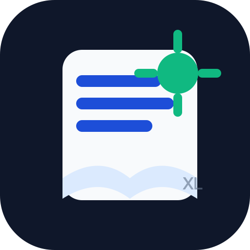
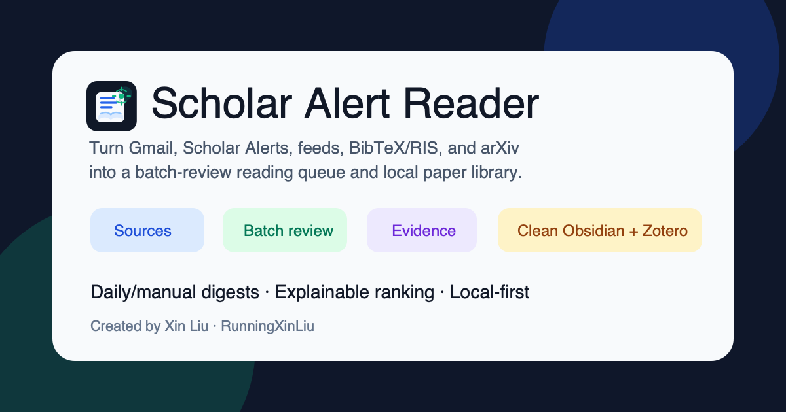
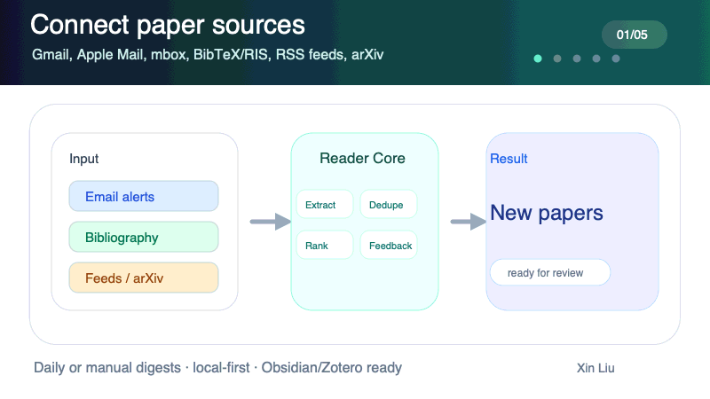
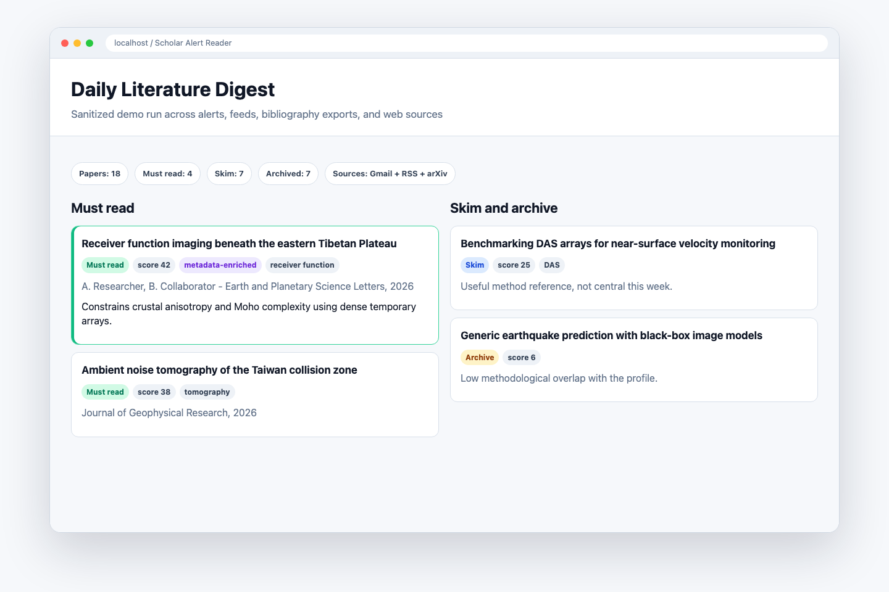
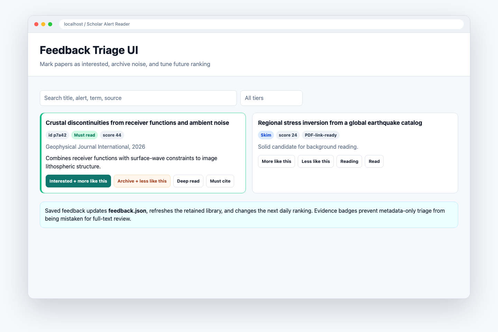
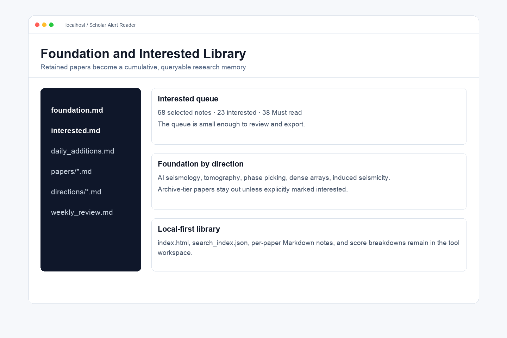
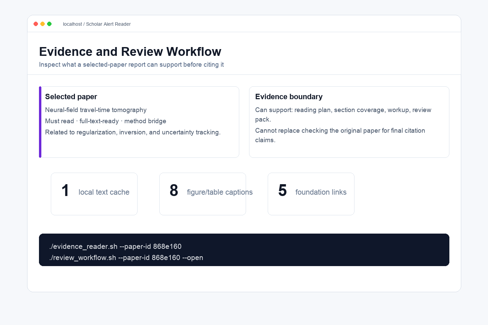
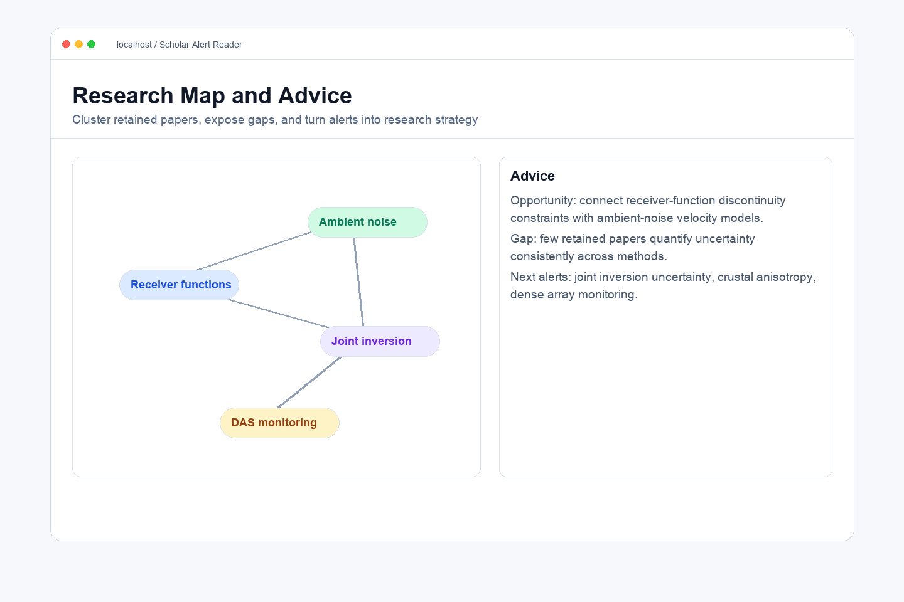
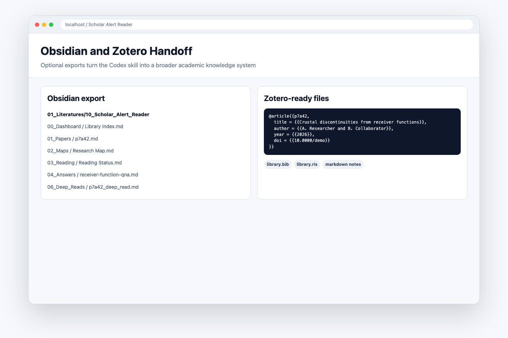
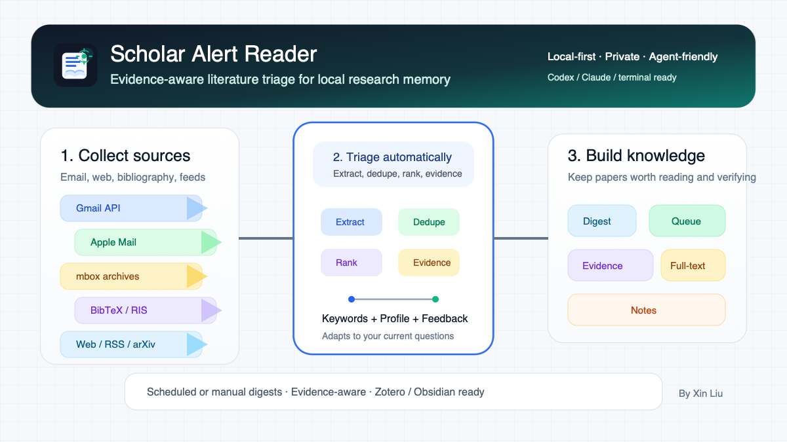

<p align="center">
  
</p>

# Scholar Alert Reader Skill

Turn paper alerts, bibliography exports, structured scholarly webpages, and web feeds into a personalized reading queue, daily digest, and cumulative research knowledge base.

Version: `0.2.15`

Created by [Xin Liu](https://github.com/RunningXinLiu).

<p align="center">
  
</p>

<p align="center">
  
</p>

## Start Here

Scholar Alert Reader works as a normal local Python CLI. Codex is the most guided entry point, but it is not required.

If you are a Codex user, install the skill and then talk to Codex in plain language:

```bash
mkdir -p ~/.codex/skills
git clone https://github.com/RunningXinLiu/scholar-alert-reader-skill.git \
  ~/.codex/skills/scholar-alert-reader
```

Restart Codex or reload skills, then ask:

```text
Use the scholar-alert-reader skill to initialize a Scholar Alert project for me.
```

Good next prompts:

- "Check whether my Gmail/Mail.app/mbox/BibTeX/RIS/web/RSS/arXiv source is ready."
- "Run the setup wizard and configure my source/profile/schedule."
- "Build my first foundation from existing Scholar Alert emails."
- "Run today's new-paper digest."
- "Import this Zotero or publisher BibTeX/RIS export into the same triage flow."
- "Import papers from this scholarly webpage or saved HTML list."
- "Pull papers from this RSS feed or arXiv query and rank them against my profile."
- "Open the feedback UI so I can mark interested papers."
- "Deep-read this paper against my foundation."
- "Export my retained library to Obsidian and Zotero."

The skill works without Obsidian or Zotero. Those are optional upgrades for people who want a larger personal knowledge system.

## Use Without Codex

You can run the core tool from any terminal or from any coding agent that can access local files and execute shell commands.

```bash
git clone https://github.com/RunningXinLiu/scholar-alert-reader-skill.git
cd scholar-alert-reader-skill
python3 -m scholar_alert_reader quickstart --project-dir ~/scholar_alerts
cd ~/scholar_alerts
./setup_wizard.sh
open QUICKSTART_REPORT.md
```

Agent compatibility:

- **Claude Code**: supported through the Python CLI. This repo includes `CLAUDE.md` with Claude-specific operating notes.
- **Cursor, Windsurf, Gemini CLI, and similar local agents**: supported if they can run shell commands and read/write local files.
- **Claude Desktop or web chat**: can help interpret outputs, but needs a local tool/MCP/file bridge to run the workflow on your machine.
- **Plain terminal**: fully supported through `python3 -m scholar_alert_reader`, the installed `scholar-alert-reader` command, the compatibility wrapper at `scripts/scholar_reader.py`, and the generated project scripts.

What is agent-specific:

- `SKILL.md` is for Codex skill loading and guided operation.
- `CLAUDE.md` is for Claude Code orientation.
- The durable source of truth is the Python CLI plus local project files, not any one agent.

## Screenshots

Sanitized demo screenshots are included for product previews and sharing.

| Daily digest | Feedback triage |
|---|---|
|  |  |

| Foundation and interested library | Deep read copilot |
|---|---|
|  |  |

| Research map and advice | Obsidian and Zotero handoff |
|---|---|
|  |  |

## What It Does

- Connects to Gmail API, Apple Mail, exported `.mbox`, BibTeX/RIS files, structured scholarly webpages, RSS/Atom feeds, and arXiv queries.
- Monitors configured web sources such as publisher article pages, journal feeds, saved-search feeds, and arXiv queries without depending on a hosted service.
- Extracts paper title, author/source line, snippet, source label, and link, then deduplicates repeated papers across sources.
- Scores papers against your research profile: keywords, methods, regions, authors, exclusions, lightweight semantic queries, and temporary boost terms.
- Produces daily or manual HTML/Markdown digests, CSV/JSON outputs, and a retained knowledge base.
- Lets you mark papers as `interested`, `archive`, `more-like-this`, or `less-like-this`, so future rankings adapt to your taste.
- Includes a bundled-data `self-test` so new users can verify the install without touching private email or note libraries.
- Supports scheduled or manual runs through generated shell scripts, macOS LaunchAgent/Codex automations, or your own cron/system scheduler.
- Adds a literature-copilot layer: selected-paper deep reads, local-library Q&A, paper comparison, research maps, and gap/advice reports.
- Exports Zotero-ready BibTeX/RIS and Obsidian-ready Markdown notes while keeping both tools optional.

## Product Modes

Scholar Alert Reader is useful without any external note app:

1. **Codex-only**: read alerts or bibliography exports, rank papers, write HTML/Markdown digests, maintain a local knowledge base, and use deep-read/Q&A/review-pack/advice commands.
2. **Codex + Obsidian**: sync generated notes, maps, reading status, answers, comparisons, and deep reads into a generated Obsidian folder.
3. **Codex + Zotero + Obsidian**: use Zotero for citations/PDFs and Obsidian for durable human-written notes and synthesis.

Obsidian and Zotero are optional integrations. The core workflow remains local files plus Codex.

## Architecture



Chinese sharing assets are also included under `docs/assets/*.zh.*` and paired with Chinese copy in [docs/share-copy.zh.md](docs/share-copy.zh.md).

## Platform Support

- Gmail API source: macOS, Linux, and Windows, as long as Python can open the OAuth browser flow once and store the token.
- Exported `.mbox` source: macOS, Linux, and Windows.
- BibTeX/RIS source: macOS, Linux, and Windows. Useful when the user has Zotero, EndNote, publisher exports, Google Scholar library exports, or no Gmail access.
- Structured webpage metadata, RSS/Atom, and arXiv sources: macOS, Linux, and Windows. Useful for publisher article pages, journal feeds, saved-search feeds, and structured web monitoring without deep crawling.
- Mail.app source: macOS only, because it uses AppleScript and requires Automation permission.
- LaunchAgent scheduling: macOS only. Other platforms can use cron, systemd timers, or Task Scheduler around `run_reader.sh` / the Python CLI.
- Codex skill mode is the intended UX, but the Python CLI can also be run directly from this repository.

## Framework Layout

```text
scholar_alert_reader/
├── core.py        # CLI, source parsing/ranking pipeline, knowledge-base writes
├── copilot.py     # deep-read, Q&A, advice, maps, Obsidian rendering
├── diagnostics.py # setup checks
├── enrich.py      # OpenAlex/Crossref enrichment
├── export.py      # BibTeX/RIS/Markdown/JSONL exporters
├── server.py      # local browser feedback UI
└── weekly.py      # weekly synthesis renderer
```

The package can run as `python3 -m scholar_alert_reader` or as an installed `scholar-alert-reader` command. The original `scripts/scholar_reader.py` path is kept as a compatibility wrapper, so existing automations can continue to call it.

## Install As A CLI

Run directly from a clone:

```bash
git clone https://github.com/RunningXinLiu/scholar-alert-reader-skill.git
cd scholar-alert-reader-skill
python3 -m scholar_alert_reader --version
python3 -m scholar_alert_reader quickstart --project-dir ~/scholar_alerts
```

Install from the checkout into your current Python environment:

```bash
python3 -m pip install .
scholar-alert-reader quickstart --project-dir ~/scholar_alerts
```

Install straight from GitHub:

```bash
python3 -m pip install "git+https://github.com/RunningXinLiu/scholar-alert-reader-skill.git"
scholar-reader quickstart --project-dir ~/scholar_alerts
```

If you plan to use Gmail API from an installed CLI, install the optional Gmail dependencies:

```bash
python3 -m pip install "scholar-alert-reader-skill[gmail] @ git+https://github.com/RunningXinLiu/scholar-alert-reader-skill.git"
```

Initialized project scripts remember the Python used at setup time, prefer `PROJECT_DIR/.venv/bin/python` when it exists, and fall back to `python3 -m scholar_alert_reader` when the repository wrapper is not available.

## CodeGraph

CodeGraph is supported as a local structural index, but `.codegraph/` is generated state and is not the source of truth. Source code remains in `scholar_alert_reader/`, `scripts/`, and `tests/`. See [references/codegraph.md](references/codegraph.md).

## Install As A Codex Skill

Copy this folder into your Codex skills directory:

```bash
cp -R scholar-alert-reader-skill ~/.codex/skills/scholar-alert-reader
```

Then restart Codex or reload skills.

You can also install directly from GitHub:

```bash
mkdir -p ~/.codex/skills
git clone https://github.com/RunningXinLiu/scholar-alert-reader-skill.git \
  ~/.codex/skills/scholar-alert-reader
```

After that, Codex can read `SKILL.md` and guide the user through setup, source checks, Gmail OAuth, daily runs, feedback, deep reads, and optional Obsidian/Zotero exports.

## Gmail API Setup

Install dependencies in your preferred Python environment:

```bash
python3 -m pip install -r requirements-gmail.txt
```

Create a Google Cloud OAuth client with application type `Desktop app`, download the JSON, and save it as:

```text
~/.codex/scholar-alert-reader/gmail_credentials.json
```

Authorize Gmail:

```bash
python3 -m scholar_alert_reader auth-gmail \
  --gmail-credentials ~/.codex/scholar-alert-reader/gmail_credentials.json \
  --gmail-token ~/.codex/scholar-alert-reader/gmail_token.json
```

Gmail OAuth distribution model:

- Do not ship your own OAuth client JSON in this repository.
- For private or small-team use, each user should create their own Google Cloud Desktop OAuth client and add themselves as a test user when needed.
- For a public hosted/shared app, the app owner must handle Google OAuth verification before broad distribution.
- The skill requests Gmail read-only access: `https://www.googleapis.com/auth/gmail.readonly`.

## Quick Start

Create a runnable local project:

```bash
python3 -m scholar_alert_reader quickstart --project-dir ~/scholar_alerts
cd ~/scholar_alerts
```

`quickstart` creates the project, runs private-data-free checks and demos, and writes `QUICKSTART_REPORT.md`. To do the steps manually instead:

```bash
python3 -m scholar_alert_reader init-project --project-dir ~/scholar_alerts
cd ~/scholar_alerts
```

Run the bundled-data self-test. It does not read Gmail, Mail.app, Zotero, Obsidian, or any personal files:

```bash
./self_test.sh
```

Open the generated onboarding guide:

```bash
cat START_HERE.md
./guide_reader.sh
```

Try the built-in demo without Gmail, Obsidian, or Zotero:

```bash
./demo_reader.sh
./demo_sources.sh
./source_check.sh --source auto
open reader_out/demo/digest.html
```

`demo_sources.sh` runs sanitized examples for mbox, BibTeX, RIS, webpage metadata, and RSS into `reader_out/demo_sources/`.

Persist your local defaults:

```bash
./setup_wizard.sh
```

Or configure non-interactively:

```bash
./setup_reader.sh \
  --source auto \
  --profile-template ai-seismology \
  --schedule-time 09:00 \
  --schedule-days weekdays
```

Both setup paths write `reader.env`, which is automatically read by generated helper scripts. Explicit one-off command variables still win, so `SOURCE=mbox ./run_reader.sh`, `WEB_SOURCE=... ./web_import.sh`, or `RSS_SOURCE=... ./rss_import.sh` can override the saved defaults.

The wizard also writes `SOURCE_CHECK.md` after configuration. Add `--live-check` when you want it to attempt a real Gmail, mbox, bibliography, web, RSS, or arXiv read immediately.

Choose a starting research profile:

```bash
python3 -m scholar_alert_reader list-profile-templates
./copy_profile_template.sh --template ai-seismology --force
```

Bundled templates include:

- `general-geophysics`: broad seismology/geophysics triage.
- `ai-seismology`: foundation models, phase picking, association, relocation, continuous waveform learning, and benchmarks.
- `induced-seismicity`: injection-induced seismicity, microseismic monitoring, mechanisms, hazards, and case comparison.
- `seismic-imaging`: surface waves, ambient noise, receiver functions, anisotropy, FWI, and inversion uncertainty.
- `dense-array-monitoring`: dense arrays, DAS, urban monitoring, continuous detection, and array processing.

The template is only the starting point. Edit `profiles/research_profile.json` to add your own regions, authors, methods, exclusions, semantic queries, and temporary boost terms.

`semantic_queries` are short natural-language descriptions of things you care about. They use local token-overlap matching, not a hosted embedding service, so they can rescue papers whose wording differs from your exact keywords while keeping the score explainable.

Run daily triage:

```bash
./run_reader.sh
```

Import from BibTeX or RIS without Gmail:

```bash
cp ~/Downloads/my_papers.bib import.bib
./bibtex_import.sh
open reader_out/bibtex/digest.html
```

```bash
cp ~/Downloads/my_papers.ris import.ris
./ris_import.sh
open reader_out/ris/digest.html
```

You can also test the import route with sanitized examples:

```bash
BIBTEX_PATH=examples/sample_import.bib ./bibtex_import.sh
RIS_PATH=examples/sample_import.ris ./ris_import.sh
```

Import from structured scholarly webpages, RSS/Atom, or arXiv:

```bash
WEB_SOURCE=examples/sample_web_article.html ./web_import.sh
open reader_out/web/digest.html
```

```bash
WEB_SOURCE=examples/web_sources.example.txt ./web_import.sh
open reader_out/web/digest.html
```

The webpage importer reads common scholarly metadata from configured URLs or saved HTML files: citation meta tags, JSON-LD, Dublin Core, and OpenGraph. It is meant for article pages and saved search pages with structured metadata, not arbitrary full-site crawling.

```bash
RSS_SOURCE=examples/sample_feed.atom ./rss_import.sh
open reader_out/rss/digest.html
```

```bash
ARXIV_QUERY='cat:physics.geo-ph AND all:tomography' ./arxiv_search.sh
open reader_out/arxiv/digest.html
```

Open the feedback UI:

```bash
./serve_reader.sh
```

Review recent alerts again without modifying the cumulative library:

```bash
./review_recent.sh
./serve_recent.sh
```

You can still run directly from this repository:

```bash
python3 scripts/scholar_reader.py daily --source-gmail --profile profiles/research_profile.json --out-dir out/daily --kb-dir knowledge_base
```

Direct BibTeX/RIS imports use the same ranking and knowledge-base pipeline:

```bash
python3 scripts/scholar_reader.py run --source-bibtex ~/Downloads/export.bib --profile profiles/research_profile.json --out-dir out/bibtex --kb-dir knowledge_base
python3 scripts/scholar_reader.py run --source-ris ~/Downloads/export.ris --profile profiles/research_profile.json --out-dir out/ris --kb-dir knowledge_base
```

Direct webpage/RSS/arXiv imports use the same pipeline:

```bash
python3 scripts/scholar_reader.py run --source-web ~/scholar_alerts/web_sources.txt --profile profiles/research_profile.json --out-dir out/web --kb-dir knowledge_base
python3 scripts/scholar_reader.py run --source-rss ~/scholar_alerts/feeds.txt --profile profiles/research_profile.json --out-dir out/rss --kb-dir knowledge_base
python3 scripts/scholar_reader.py run --source-arxiv-query 'cat:physics.geo-ph AND all:tomography' --profile profiles/research_profile.json --out-dir out/arxiv --kb-dir knowledge_base
```

## Feedback Loop

Each digest includes a short paper `ID`. Mark papers from the latest `papers.json`:

```bash
python3 scripts/scholar_reader.py feedback \
  --profile profiles/research_profile.json \
  --papers-json out/daily/papers.json \
  --paper-id <ID> \
  --mark interested \
  --more-like-this
```

Suppress a paper and similar future papers:

```bash
python3 scripts/scholar_reader.py feedback \
  --profile profiles/research_profile.json \
  --papers-json out/daily/papers.json \
  --paper-id <ID> \
  --mark archive \
  --less-like-this
```

The command writes `knowledge_base/feedback.json` by default and immediately refreshes `foundation.md` / `interested.md` when the selected paper should enter or leave the retained library. Later `daily`, `foundation`, and `run` commands load that file automatically when they use the same `--kb-dir`. Use `--no-feedback` on a run to ignore saved feedback temporarily.

Start the local feedback UI:

```bash
python3 scripts/scholar_reader.py serve \
  --profile profiles/research_profile.json \
  --papers-json out/daily/papers.json \
  --kb-dir knowledge_base \
  --open
```

## Literature Copilot

Analyze one selected paper against your retained foundation/interested library:

```bash
python3 scripts/scholar_reader.py deep-read \
  --profile profiles/research_profile.json \
  --kb-dir knowledge_base \
  --papers-json out/recent/papers.json \
  --paper-id <ID>
```

Capability boundary: `deep-read`, `ask`, `compare`, `map`, and `advice` use alert metadata, bibliography fields, snippets, profile terms, feedback, and the retained local library. They are designed for triage and research planning. `full-text` can extract a local PDF/text file when you provide the path or sync it from Zotero; the tool does not automatically download publisher PDFs.

If a local PDF path has been synced from Zotero, extract text and write a full-text brief:

```bash
python3 scripts/scholar_reader.py full-text \
  --profile profiles/research_profile.json \
  --kb-dir knowledge_base \
  --paper-id <ID>
```

`full-text` uses local files only. It tries `pdftotext` first, then optional Python PDF libraries (`pypdf` / `PyPDF2`), and also accepts `.txt` / `.md` text exports through `--pdf-path`. It writes `knowledge_base/full_text/<paper-id>.txt` and `knowledge_base/analysis/<paper-id>_full_text_brief.md`.

Build an LLM-ready review context pack for Codex, Claude, ChatGPT, or another markdown-capable assistant:

```bash
python3 scripts/scholar_reader.py review-pack \
  --profile profiles/research_profile.json \
  --kb-dir knowledge_base \
  --paper-id <ID>
```

`review-pack` writes `knowledge_base/analysis/<paper-id>_review_pack.md`. It combines the selected paper, your research profile, feedback status, closest foundation papers, interested/active-reading papers, and any cached `knowledge_base/full_text/<paper-id>.txt`. Paste that file into your assistant when you want a more careful discussion of one paper without uploading your whole mailbox or knowledge base.

Ask a question against the local literature base:

```bash
python3 scripts/scholar_reader.py ask \
  --profile profiles/research_profile.json \
  --kb-dir knowledge_base \
  --question "receiver function + Tibet 有哪些关键论文？"
```

Generate research-gap and reading-strategy advice:

```bash
python3 scripts/scholar_reader.py advice \
  --profile profiles/research_profile.json \
  --kb-dir knowledge_base
```

Project scaffolds also provide `./deep_read_paper.sh`, `./full_text_paper.sh`, `./review_paper.sh`, `./tune_profile.sh`, `./ask_library.sh`, and `./advice_reader.sh`.

Tune the profile after you have marked papers as interested/archive or more-like-this/less-like-this:

```bash
python3 scripts/scholar_reader.py profile-tune \
  --profile profiles/research_profile.json \
  --kb-dir knowledge_base
```

`profile-tune` writes `knowledge_base/profile_tuning.md` with suggested `focus_terms`, `semantic_queries`, and `exclude_terms`. It does not edit the profile unless you pass `--apply`.

## Reading System And Integrations

Track reading state and labels:

```bash
python3 scripts/scholar_reader.py status \
  --profile profiles/research_profile.json \
  --kb-dir knowledge_base \
  --papers-json out/recent/papers.json \
  --paper-id <ID> \
  --status reading \
  --label must-cite
```

Compare selected papers:

```bash
python3 scripts/scholar_reader.py compare \
  --profile profiles/research_profile.json \
  --kb-dir knowledge_base \
  --paper-id <ID1>,<ID2>
```

Generate a topic map from the retained library:

```bash
python3 scripts/scholar_reader.py map \
  --profile profiles/research_profile.json \
  --kb-dir knowledge_base
```

Export Zotero-ready BibTeX/RIS files:

```bash
python3 scripts/scholar_reader.py zotero \
  --profile profiles/research_profile.json \
  --kb-dir knowledge_base
```

Read Zotero / Better BibTeX metadata back into the retained library:

```bash
python3 scripts/scholar_reader.py zotero-sync \
  --profile profiles/research_profile.json \
  --kb-dir knowledge_base \
  --bibtex ~/Downloads/My_Library.bib
```

This matches retained papers by DOI or normalized title and stores Zotero citation keys, item keys, and local PDF paths under `metadata.zotero`. Obsidian exports then reuse the Zotero citation key and include linked PDF paths in paper-note frontmatter.

Export an Obsidian-ready Markdown folder:

```bash
python3 scripts/scholar_reader.py obsidian \
  --profile profiles/research_profile.json \
  --kb-dir knowledge_base \
  --vault-dir "~/Documents/Obsidian Vault/01_Literatures/10_Scholar_Alert_Reader"
```

The Obsidian export is structured as `00_Dashboard/`, `01_Papers/`, `02_Maps/`, `03_Reading/`, `04_Answers/`, `05_Comparisons/`, and `06_Deep_Reads/` inside the target folder. Keep that generated folder separate from user-written reading notes and topic notes.

Project scaffolds also provide `./status_reader.sh`, `./compare_papers.sh`, `./map_reader.sh`, `./zotero_export.sh`, `./zotero_sync.sh`, `./obsidian_export.sh`, and `./sync_obsidian_vault.sh`.

Check input-source readiness without running the full workflow:

```bash
./source_check.sh --source auto
./source_check.sh --source gmail --live
./source_check.sh --source mail-app --live
./source_check.sh --source mbox --mbox-path examples/sample_scholar_alerts.mbox --live
./source_check.sh --source bibtex --bibtex-path import.bib --live
./source_check.sh --source ris --ris-path import.ris --live
./source_check.sh --source web --web-source examples/sample_web_article.html --live
./source_check.sh --source rss --rss-source examples/sample_feed.atom --live
./source_check.sh --source arxiv --arxiv-query 'cat:physics.geo-ph AND all:tomography' --live
```

`mail-app` is intentionally explicit because it can trigger macOS Automation permission prompts.

## Metadata And Weekly Review

Enrich the retained library with public metadata:

```bash
python3 scripts/scholar_reader.py enrich \
  --profile profiles/research_profile.json \
  --kb-dir knowledge_base \
  --limit 20 \
  --providers openalex,crossref \
  --update-library
```

Generate or refresh the weekly synthesis:

```bash
python3 scripts/scholar_reader.py weekly \
  --profile profiles/research_profile.json \
  --kb-dir knowledge_base \
  --days 7
```

The richer knowledge base includes:

- `papers/<paper-id>.md`: one note page per retained paper
- `directions/*.md`: retained papers grouped by topic tags
- `weekly_review.md`: recurring synthesis from the retained library
- `profile_tuning.md`: suggested profile updates from feedback patterns
- `full_text/<paper-id>.txt`: optional local text cache extracted from a PDF/text file
- `analysis/<paper-id>_review_pack.md`: selected-paper review context for an assistant

## Export And Diagnostics

Export retained papers:

```bash
python3 scripts/scholar_reader.py export \
  --profile profiles/research_profile.json \
  --kb-dir knowledge_base \
  --format bibtex
```

Supported export formats are `bibtex`, `ris`, `markdown`, and `jsonl`.

Check a local setup:

```bash
python3 -m scholar_alert_reader self-test --strict
python3 -m scholar_alert_reader doctor \
  --profile profiles/research_profile.json \
  --kb-dir knowledge_base \
  --out-dir out/daily \
  --gmail-deps
```

Render a product-oriented setup/status guide:

```bash
python3 -m scholar_alert_reader guide \
  --project-dir ~/scholar_alerts \
  --output ~/scholar_alerts/START_HERE.md
```

Pass `--obsidian-dir` and `--zotero-dir` only when those integrations are enabled.

If a source returns no papers, Gmail OAuth is blocked, or generated outputs are missing, see [TROUBLESHOOTING.md](TROUBLESHOOTING.md).

## Testing

```bash
python -m py_compile scripts/scholar_reader.py scholar_alert_reader/*.py
python -m scholar_alert_reader --version
python -m unittest discover -s tests
```

GitHub Actions runs the same checks on Python 3.10, 3.11, and 3.12.

## Privacy

See [PRIVACY.md](PRIVACY.md). The short version: do not publish raw mailbox exports, OAuth credentials, Gmail tokens, `seen_papers.json`, `feedback.json`, or generated knowledge bases unless you have reviewed and sanitized them.

## Do Not Commit

Do not commit:

- Gmail OAuth credentials or token files
- raw mailbox exports
- personal `import.bib` / `import.ris` files
- personal `web_sources.txt` source lists
- personal `zotero.bib` read-back files
- personal `feeds.txt` source lists
- `reader.env`
- `seen_papers.json`
- `feedback.json`
- generated `knowledge_base/full_text/` text caches
- generated `out/`
- generated `knowledge_base/`
