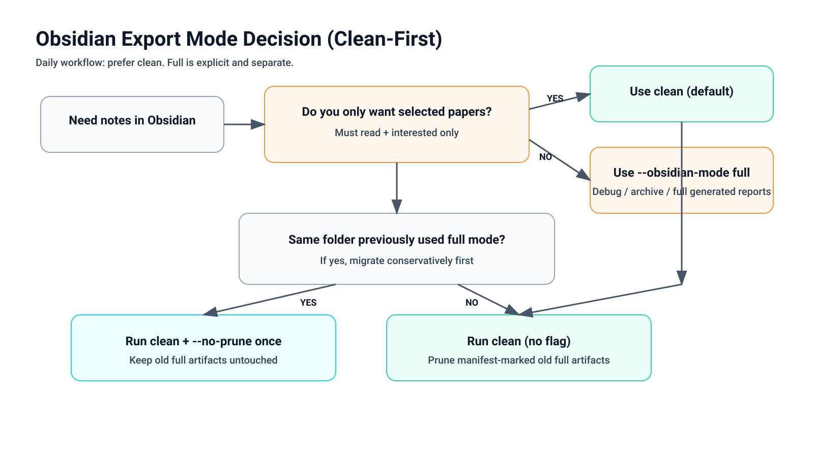
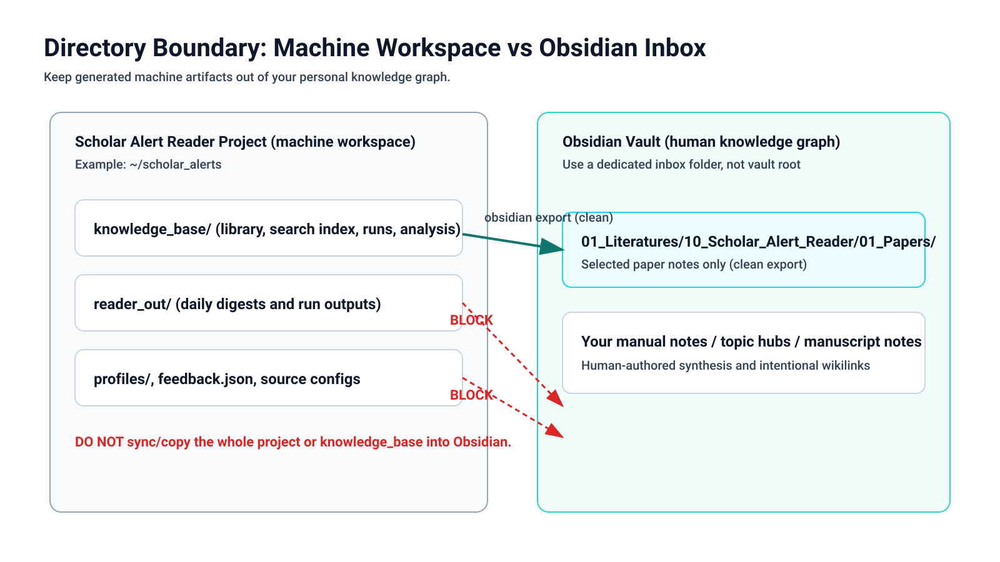
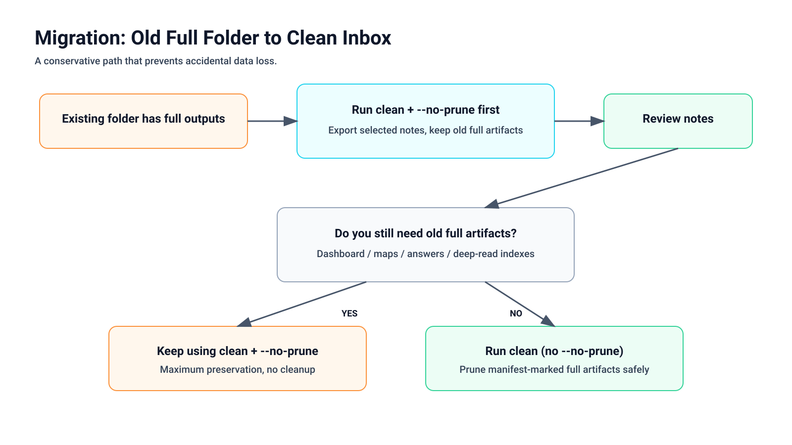
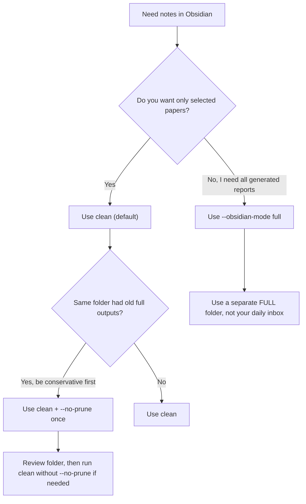
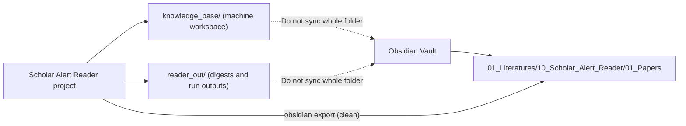
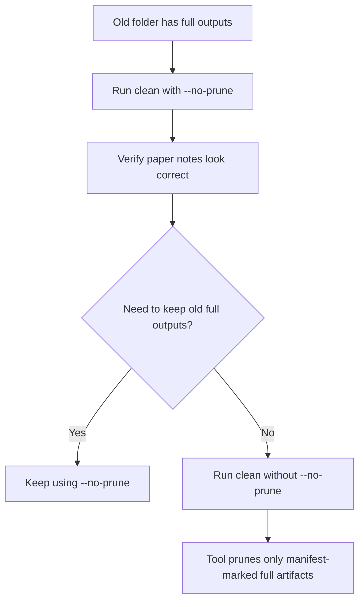

# Obsidian Export Guide (Clean-First)

This guide defines a safe operating model:

- `knowledge_base/` is the machine workspace.
- Obsidian receives selected paper notes by default.
- `clean` is the default mode.
- `full` is explicit and for debugging/archive use.

## Visual Quick Reference







## Mode Decision



## Directory Boundary



## Migration Flow (Old Full Folder -> Clean Inbox)



## 10-Minute Setup

1. Keep your local project outside Obsidian:
   - Example: `~/scholar_alerts`
2. Pick a dedicated Obsidian inbox folder (not vault root):
   - Example: `~/Documents/Obsidian Vault/01_Literatures/10_Scholar_Alert_Reader`
3. Run daily triage from your project:
   - `./run_reader.sh` or source-specific import scripts
4. Export to Obsidian in clean mode (default):

```bash
python3 scripts/scholar_reader.py obsidian \
  --profile profiles/research_profile.json \
  --kb-dir knowledge_base \
  --vault-dir "$HOME/Documents/Obsidian Vault/01_Literatures/10_Scholar_Alert_Reader"
```

5. If the target folder previously used `full`, first run:

```bash
python3 scripts/scholar_reader.py obsidian \
  --profile profiles/research_profile.json \
  --kb-dir knowledge_base \
  --vault-dir "$HOME/Documents/Obsidian Vault/01_Literatures/10_Scholar_Alert_Reader" \
  --obsidian-mode clean \
  --no-prune
```

6. Use full mode only when you intentionally need generated dashboards/reports:

```bash
python3 scripts/scholar_reader.py obsidian \
  --profile profiles/research_profile.json \
  --kb-dir knowledge_base \
  --obsidian-mode full \
  --vault-dir "$HOME/Documents/Obsidian Vault/01_Literatures/10_Scholar_Alert_Reader_FULL"
```

## What Clean Exports

- `01_Papers/*.md` only.
- Only `Must read` papers and papers marked `interested`.
- Notes include generated frontmatter (`source_tool`, `obsidian_import`, `tier`, `score`, `reading_status`, `tags`, `source_types`).
- No automatic `[[wikilinks]]`.

## What Clean Does Not Export

- Dashboard/index/search workspace files.
- `answers/`, `analysis/`, `runs/`, and other machine report folders.

## Do / Do Not

Do:
- Keep Obsidian export in a dedicated inbox folder.
- Use `clean` for daily use.
- Use `full` in a separate folder when needed.

Do not:
- Sync or copy the entire `knowledge_base/` into Obsidian.
- Export to vault root.
- Mix daily clean inbox and full archive outputs in one folder unless intentional.

## Quick Command Reference

```bash
# Recommended daily export
python3 scripts/scholar_reader.py obsidian --profile profiles/research_profile.json --kb-dir knowledge_base --vault-dir "$HOME/Documents/Obsidian Vault/01_Literatures/10_Scholar_Alert_Reader"

# Conservative clean export (skip prune)
python3 scripts/scholar_reader.py obsidian --profile profiles/research_profile.json --kb-dir knowledge_base --vault-dir "$HOME/Documents/Obsidian Vault/01_Literatures/10_Scholar_Alert_Reader" --no-prune

# Full export (explicit)
python3 scripts/scholar_reader.py obsidian --profile profiles/research_profile.json --kb-dir knowledge_base --obsidian-mode full --vault-dir "$HOME/Documents/Obsidian Vault/01_Literatures/10_Scholar_Alert_Reader_FULL"
```
