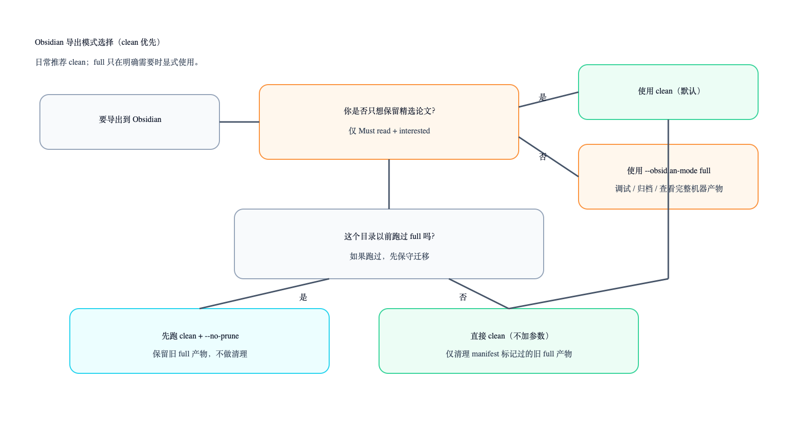
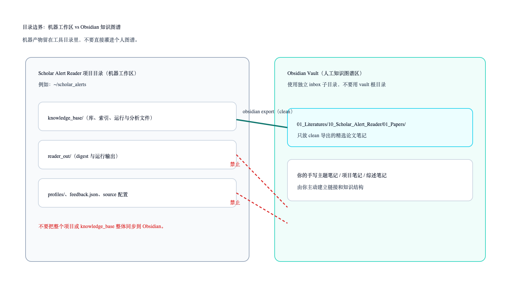
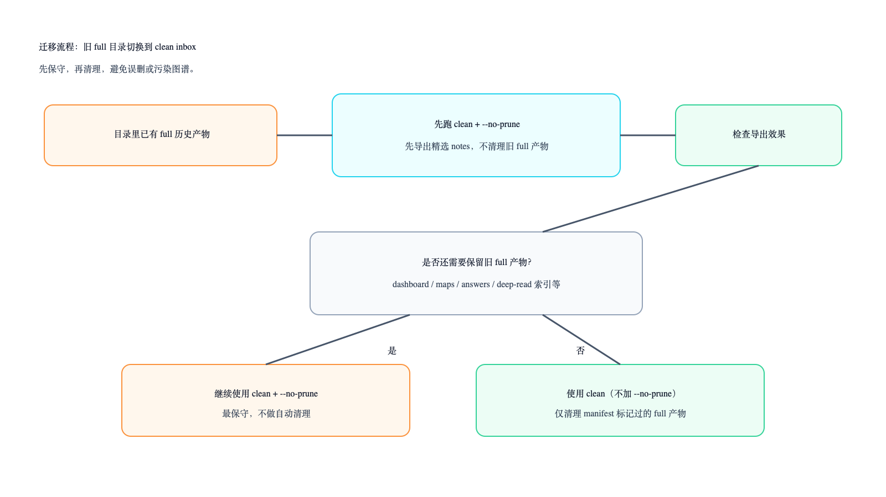
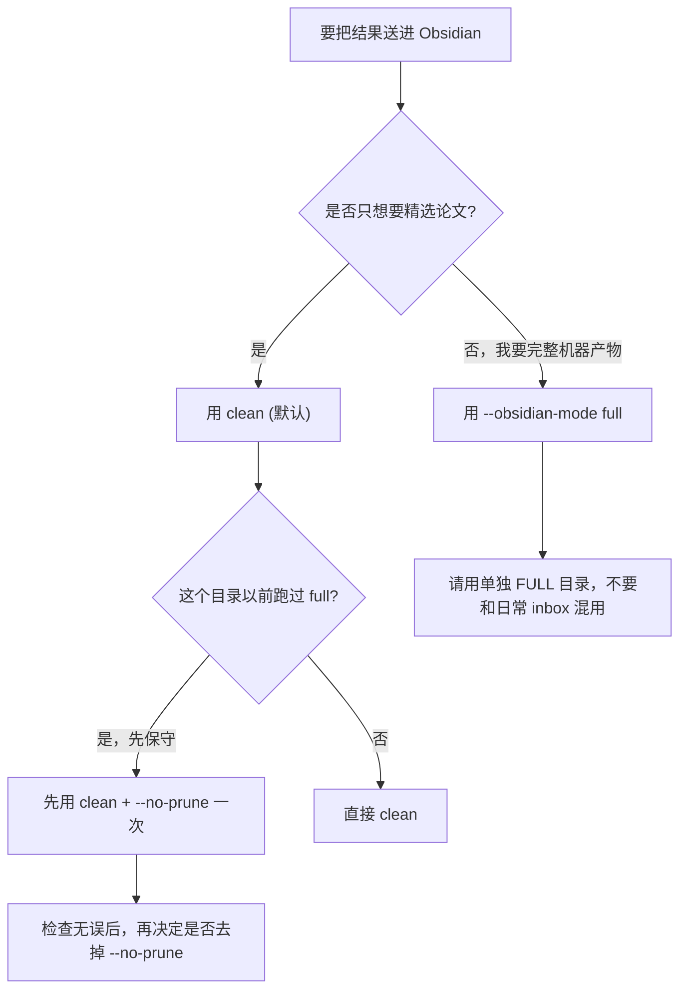
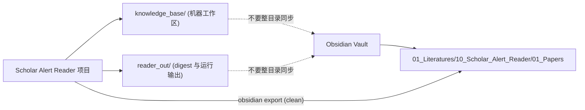
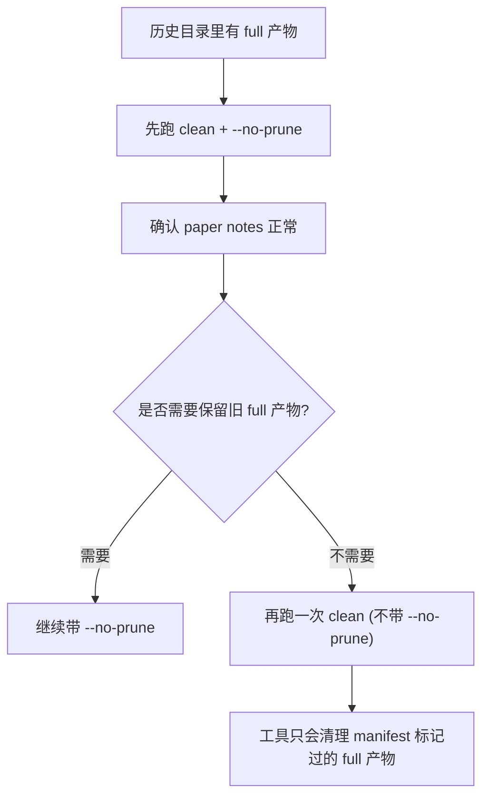

# Obsidian 导出指南（以 clean 为默认）

这份指南的核心边界：

- `knowledge_base/` 是机器工作区。
- Obsidian 默认只接收精选论文笔记。
- `clean` 是默认模式。
- `full` 必须显式指定，只用于调试/归档。

## 图示速览







## 模式选择图



## 目录边界图



## 旧 full 目录迁移到 clean 的流程



## 10 分钟落地步骤

1. 先把本地项目放在 Obsidian 外部：
   - 例如：`~/scholar_alerts`
2. 在 Obsidian 里给导出建独立 inbox 目录（不要放 Vault 根目录）：
   - 例如：`~/Documents/Obsidian Vault/01_Literatures/10_Scholar_Alert_Reader`
3. 在项目目录跑日常筛选：
   - `./run_reader.sh` 或各类 source import 脚本
4. 用 clean 导出（默认）：

```bash
python3 scripts/scholar_reader.py obsidian \
  --profile profiles/research_profile.json \
  --kb-dir knowledge_base \
  --vault-dir "$HOME/Documents/Obsidian Vault/01_Literatures/10_Scholar_Alert_Reader"
```

5. 如果这个目录以前用过 full，先保守跑一次：

```bash
python3 scripts/scholar_reader.py obsidian \
  --profile profiles/research_profile.json \
  --kb-dir knowledge_base \
  --vault-dir "$HOME/Documents/Obsidian Vault/01_Literatures/10_Scholar_Alert_Reader" \
  --obsidian-mode clean \
  --no-prune
```

6. 只有在你明确需要完整机器产物时才用 full：

```bash
python3 scripts/scholar_reader.py obsidian \
  --profile profiles/research_profile.json \
  --kb-dir knowledge_base \
  --obsidian-mode full \
  --vault-dir "$HOME/Documents/Obsidian Vault/01_Literatures/10_Scholar_Alert_Reader_FULL"
```

## clean 会导出什么

- 只导出 `01_Papers/*.md`。
- 只包含 `Must read` 和标记为 `interested` 的论文。
- frontmatter 包含 `source_tool`、`obsidian_import`、`tier`、`score`、`reading_status`、`tags`、`source_types`。
- 不会自动生成 `[[wikilinks]]`。

## clean 不会导出什么

- dashboard/index/search 这类机器工作区文件。
- `answers/`、`analysis/`、`runs/` 等机器报告目录。

## 建议与禁忌

建议：
- 导出到 Obsidian 的独立 inbox 目录。
- 日常固定用 `clean`。
- `full` 放在单独目录，按需使用。

不要：
- 把整个 `knowledge_base/` 同步或拷贝进 Obsidian。
- 导出到 Vault 根目录。
- 把日常 clean inbox 和 full 归档目录混在一个目录里（除非你非常确定这是你要的）。

## 命令速查

```bash
# 日常推荐导出
python3 scripts/scholar_reader.py obsidian --profile profiles/research_profile.json --kb-dir knowledge_base --vault-dir "$HOME/Documents/Obsidian Vault/01_Literatures/10_Scholar_Alert_Reader"

# 保守导出（不清理旧 full 产物）
python3 scripts/scholar_reader.py obsidian --profile profiles/research_profile.json --kb-dir knowledge_base --vault-dir "$HOME/Documents/Obsidian Vault/01_Literatures/10_Scholar_Alert_Reader" --no-prune

# 显式 full 导出
python3 scripts/scholar_reader.py obsidian --profile profiles/research_profile.json --kb-dir knowledge_base --obsidian-mode full --vault-dir "$HOME/Documents/Obsidian Vault/01_Literatures/10_Scholar_Alert_Reader_FULL"
```
