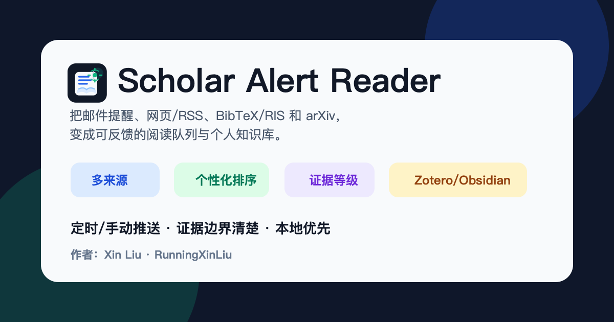
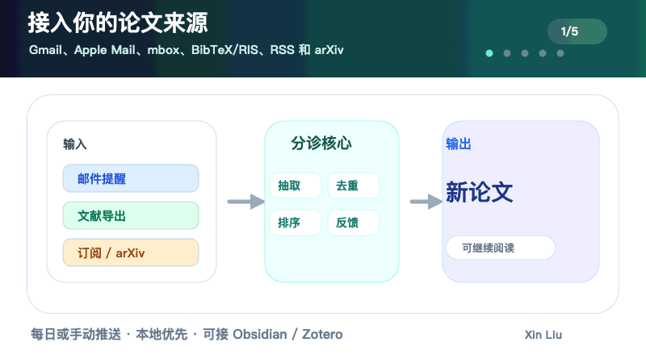

# Scholar Alert Reader 中文用户手册

> 本手册面向第一次使用的人：不要求安装 Codex、Obsidian 或 Zotero。核心目标是把 Google Scholar Alert、RSS/arXiv、BibTeX/RIS 等来源里的论文候选，变成本地可筛选、可反馈、可沉淀的个人文献库。



## 1. 它解决什么问题

每天的 Scholar Alert 邮件、RSS feed 和文献库导出很容易变成噪音。Scholar Alert Reader 做的是一条本地文献分诊流水线：

```text
论文来源
  -> 解析元数据
  -> 去重
  -> 按研究画像打分
  -> 生成 Review Workspace / digest
  -> 人工反馈 interested / archive / more-like-this / less-like-this
  -> 更新本地 foundation / interested library
  -> 可选导出到 Obsidian / Zotero
```



它不是 Zotero 或 Obsidian 的替代品，也不是全自动阅读全文机器人。更准确地说，它是一个本地、隐私优先、轻量化的文献筛选和文献库构建工具。

## 2. 你会得到什么

一次运行后，最重要的是这些文件和页面：

| 输出 | 作用 |
|---|---|
| `Review Workspace` | 浏览器里的交互式筛选界面，最适合日常使用 |
| `reader_out/<mode>/digest.html` | 静态 digest，可归档或分享给自己 |
| `knowledge_base/index.html` | 本地轻量文献库首页 |
| `knowledge_base/papers/*.md` | 每篇论文的 Markdown 记录 |
| `knowledge_base/feedback.json` | 你的 interested/archive/more-like-this 等反馈 |
| `knowledge_base/zotero/*.bib/.ris` | 可导入 Zotero 的引用文件 |
| Obsidian clean notes | 可选，只导出精选论文笔记 |


## 3. 三分钟 demo：不接 Gmail 也能先跑通

先用内置 RSS 样例验证流程。这个 demo 不读私人邮箱、不需要 Obsidian/Zotero，也不需要 Google OAuth。

```bash
git clone https://github.com/RunningXinLiu/scholar-alert-reader-skill.git
cd scholar-alert-reader-skill

python3 scripts/scholar_reader.py init-project \
  --project-dir ~/scholar_alerts_demo \
  --profile-template seismic-imaging

cd ~/scholar_alerts_demo
RSS_SOURCE=examples/sample_feed.atom ./rss_import.sh
PAPERS_JSON=reader_out/rss/papers.json ./serve_reader.sh
```

浏览器打开后，先看：

- 论文是否按 `Must read / Skim / Archive` 分层。
- 每篇论文是否有推荐理由和证据等级。
- 批量反馈按钮是否能保存。

## 4. 推荐目录结构

建议把 Scholar Alert Reader 工作区放在 Obsidian 外部：

```text
~/scholar_alerts/
├── profiles/
│   └── research_profile.json
├── reader_out/
│   ├── foundation/
│   └── daily/
├── knowledge_base/
│   ├── index.html
│   ├── library.json
│   ├── feedback.json
│   └── papers/
└── reader.env
```

如果用 Obsidian，建议只给它一个独立 inbox：

```text
~/Documents/Obsidian Vault/
└── 01_Literatures/
    └── 10_Scholar_Alert_Reader/
        └── 01_Papers/
```

不要把整个 `knowledge_base/` 拖进 Obsidian。`knowledge_base/` 是机器工作区，Obsidian 应该默认只接收精选论文笔记。

## 5. 配置你的研究画像

研究画像在项目目录里：

```text
profiles/research_profile.json
```

重点改这些字段：

| 字段 | 作用 |
|---|---|
| `focus_terms` | 你关心的主题，例如 seismic foundation model |
| `methods` | 方法词，例如 phase picking、FWI、self-supervised learning |
| `regions` | 区域、数据集或应用场景 |
| `semantic_queries` | 用一句话描述你真正想找的论文 |
| `exclude_terms` | 经常误报的噪音词 |
| `tier_thresholds` | Must read / Skim / Archive 的阈值 |

可以用向导快速补充：

```bash
./profile_wizard.sh \
  --focus "seismic foundation model, earthquake monitoring" \
  --method "phase picking, self-supervised learning, uncertainty quantification" \
  --region "Tibet, Sichuan Basin, North China"
```

检查画像是否太宽或太窄：

```bash
./profile_doctor.sh
open profiles/profile_doctor.md
```

## 6. Gmail 第一次接入

Gmail 是可选的，但它最适合自动读取 Google Scholar Alert。

如果你用 Codex，推荐直接让 Codex 带你走授权流程；它可以检查依赖、检查凭据位置、启动浏览器授权、再跑 source check。你需要亲自完成的只有 Google Cloud 里创建 OAuth client，以及浏览器里点一次授权。

详细步骤见：[Gmail 授权中文指南](gmail_auth_guide.zh.md)。

你需要在 Google Cloud 做一次配置：

1. 创建或选择一个 project。
2. 启用 Gmail API。
3. 配 OAuth consent screen。
4. 如果 app 处于 testing，把自己的 Gmail 加成 test user。
5. 创建 OAuth client，类型选 `Desktop app`。
6. 下载 client secret JSON。

建议把凭据放到 repo 外面：

```text
~/.codex/scholar-alert-reader/gmail_credentials.json
```

第一次授权：

```bash
python3 /path/to/scholar-alert-reader-skill/scripts/scholar_reader.py auth-gmail \
  --gmail-credentials ~/.codex/scholar-alert-reader/gmail_credentials.json \
  --gmail-token ~/.codex/scholar-alert-reader/gmail_token.json
```

在项目目录 `reader.env` 里写：

```bash
SOURCE=auto
GMAIL_CREDENTIALS=$HOME/.codex/scholar-alert-reader/gmail_credentials.json
GMAIL_TOKEN=$HOME/.codex/scholar-alert-reader/gmail_token.json
```

检查 Gmail 是否能读：

```bash
./source_check.sh --source gmail --live
```

看到 Gmail live read 成功后，再跑真实任务。

## 7. 第一次真实运行：建立 foundation

第一次不要只看当天。应该先用已有 Scholar Alert 邮件建立 foundation，形成 baseline：

```bash
MODE=foundation SOURCE=gmail ./run_reader.sh
PAPERS_JSON=reader_out/foundation/papers.json ./serve_reader.sh
```

foundation 的意义：

- 读取已有 alert 邮件。
- 去重，避免同一篇论文从多个 alert 重复出现。
- 按你的 research profile 打分。
- 建立 `seen_papers.json`，之后 daily 不再反复推旧论文。
- 写入 `knowledge_base/`，形成本地轻量文献库。


## 8. 日常运行：daily

foundation 之后，日常运行用 daily。它只显示还没见过的新论文：

```bash
SOURCE=gmail ./run_reader.sh
./serve_reader.sh
```

如果 `Papers in digest: 0`，不一定是坏了。先看诊断：

```bash
open reader_out/daily/digest.html
python3 -m json.tool reader_out/daily/summary.json | sed -n '1,120p'
```

常见原因：

- Gmail 读到了邮件，但这些论文已经在 foundation/seen state 里。
- 今天没有新的 Scholar Alert。
- Gmail 查询窗口太短。
- OAuth/token 或网络读取失败。

如果只是想重看最近邮件，不想改 foundation：

```bash
./review_recent.sh
./serve_recent.sh
```

## 9. Review Workspace 怎么用

Review Workspace 是日常最重要的入口。


如果想打开纯中文界面：

```bash
UI_LANGUAGE=zh-CN ./serve_reader.sh
```

如果想打开英文界面：

```bash
UI_LANGUAGE=en ./serve_reader.sh
```

推荐中文 profile 里保留：

```json
{"language": "zh-CN"}
```

这样 Review Workspace 的界面和打分理由都会尽量保持中文。

建议操作顺序：

1. 先用搜索框按 topic、author、venue、method 粗筛。
2. 扫 `Must read`，快速判断是否真相关。
3. 对明显有价值的论文设置 `Interested`。
4. 对明显无关的论文设置 `Archive`。
5. 对想让系统以后多推荐的方向勾 `More like this`。
6. 对误报方向勾 `Less like this`。
7. 有想法就写 `Personal note`。
8. 最后统一点 `Save selected changes`。

每篇论文卡片里应重点看：

- 标题和 `Open paper` 原文链接。
- 期刊/年份/DOI/来源域名。
- evidence level：metadata-only、PDF-link-ready、full-text-backed 等。
- 摘要是否是完整摘要，还是 Scholar Alert 截断片段。
- score reason：为什么它被推荐或降权。
- 你的反馈状态和阅读状态。

## 10. 批量保存逻辑

当前 UI 不是每点一次就立即写入，而是先累积 pending changes，再统一保存。


一次保存可以同时包含：

- `Decision`: Interested / Archive / Neutral。
- `Priority`: Must read / Skim / Archive。
- `Learning signal`: More like this / Less like this。
- `Reading status`: Reading / Read / Must cite / Background only / Not relevant。
- `Generate report on save`: Deep read / Full review / Workup / Review pack。
- `Personal note`: append、replace 或 clear。

保存后会更新：

- `knowledge_base/feedback.json`
- `knowledge_base/library.json`
- `knowledge_base/interested.md`
- per-paper Markdown note
- 后续 daily ranking 的反馈加权

## 11. 它怎么打分

打分不是黑箱。每篇论文都会有可解释的 score breakdown：

| 组件 | 含义 |
|---|---|
| Topic fit | 和主题词的匹配 |
| Method fit | 和方法词的匹配 |
| Domain/region fit | 和区域、数据集、应用场景的匹配 |
| Semantic fit | 和 `semantic_queries` 的轻量语义匹配 |
| Author/source signal | 关注作者或来源信号 |
| Feedback similarity | 和你标过 interested/more-like-this 的论文相似 |
| Exclusion penalty | 命中排除词或噪音模式 |

这套解释会出现在 digest、paper note、search index 和 Review Workspace 里。

## 12. 不用 Gmail 的来源

RSS/Atom：

```bash
RSS_SOURCE=examples/sample_feed.atom ./rss_import.sh
PAPERS_JSON=reader_out/rss/papers.json ./serve_reader.sh
```

arXiv：

```bash
ARXIV_QUERY='cat:physics.geo-ph AND all:tomography' ./arxiv_search.sh
PAPERS_JSON=reader_out/arxiv/papers.json ./serve_reader.sh
```

BibTeX：

```bash
cp ~/Downloads/library.bib import.bib
./bibtex_import.sh
PAPERS_JSON=reader_out/bibtex/papers.json ./serve_reader.sh
```

RIS：

```bash
cp ~/Downloads/library.ris import.ris
./ris_import.sh
PAPERS_JSON=reader_out/ris/papers.json ./serve_reader.sh
```

## 13. Obsidian：推荐 clean export

Obsidian 是可选的。推荐默认 clean 模式，只把精选论文 note 送进 Obsidian。

```bash
./sync_obsidian_vault.sh --obsidian-mode clean
```

clean 模式只导出：

- `Must read` 论文。
- 你手动标为 `Interested` 的论文。
- per-paper Markdown notes。

clean 模式不会导出：

- dashboard / index / search_index。
- runs / analysis / answers。
- deep-read / workup / review-pack 报告。
- 自动 `[[wikilinks]]`。


clean export 的目标是让 Obsidian 成为人的阅读 inbox，而不是机器工作区。


如果你已经把 full 模式导出进 Obsidian，迁移时可以参考：


如果你以前在同一个目录里跑过 full 模式，第一次迁移建议保守一点：

```bash
./sync_obsidian_vault.sh --obsidian-mode clean --no-prune
```

确认没问题后，再决定是否去掉 `--no-prune`。

详细指南见：

- [Obsidian 导出指南（中文）](obsidian_export_guide.zh.md)

## 14. Zotero：导出 BibTeX/RIS

Zotero 也是可选的。推荐先只导入 Must-read 或 retained papers，不要一开始把所有 Archive 也塞进去。

```bash
./zotero_export.sh
```

输出通常在：

```text
knowledge_base/zotero/scholar_alert_reader.bib
knowledge_base/zotero/scholar_alert_reader.ris
```

把 `.bib` 或 `.ris` 导入 Zotero 即可。

如果之后在 Zotero 里用 Better BibTeX 导出了库，可以把 citation key、item key 和本地 PDF 路径同步回 Scholar Alert Reader：

```bash
ZOTERO_BIBTEX_PATH=~/Downloads/My_Library.bib ./zotero_sync.sh
```

## 15. 可选报告：谨慎使用

这些功能可以帮你决定一篇论文是否值得认真读：

- `Deep read`
- `Full review`
- `Workup`
- `Review pack`
- `Research map`
- `Advice`

但要注意 evidence boundary：

- metadata-only：只基于标题、摘要、alert 元数据、profile 和反馈。
- PDF-link-ready：知道 open PDF 或 landing URL，但未必已有全文。
- local-PDF-ready / full-text-backed：本地已有 PDF/text，报告可信度更高。

metadata-only 报告只能用于 triage，不能当作 citation-ready 结论。

## 16. 隐私和公开分享

可以公开分享 repo、示例数据、demo 截图和手册。不要公开分享真实个人运行产物。

不要上传：

- Gmail credentials。
- Gmail token。
- 原始 mailbox。
- `profiles/seen_papers.json`。
- `knowledge_base/feedback.json`。
- 真实账号生成的 `knowledge_base/`。
- PDF/full-text cache。

分享前运行：

```bash
./privacy_check.sh
```

## 17. 常见问题

### daily 没有论文，是不是坏了？

不一定。先看 `reader_out/daily/summary.json`。如果 `seen_papers_filtered_out` 很高，说明这些论文已经在 foundation 里见过了。

### note 是追加还是覆盖？

Review Workspace 里可以选择 append、replace 或 clear。默认 append 不会覆盖旧笔记。

### 为什么摘要有时不完整？

Scholar Alert 邮件经常只给截断 snippet。可以在 paper 卡片里用 `Fetch abstract` 尝试从 OpenAlex/Crossref 补公开摘要。

### 为什么不自动给 Obsidian 加 wikilinks？

自动 wikilinks 会污染 Obsidian graph。工具默认只写 tags 和普通 Markdown 链接，让真正的知识连接由你读完后手动建立。

### 没有 Codex 能不能用？

可以。核心是 Python CLI 和项目目录里的脚本。Codex 只是更方便的配置和维护入口。

## 18. 推荐日常流程

```bash
cd ~/scholar_alerts
SOURCE=gmail ./run_reader.sh
./serve_reader.sh
```

每天做三件事：

1. 看 `Must read`，扫一眼 `Skim`。
2. 给 5-10 篇文章做明确反馈。
3. 每周导出一次 Obsidian clean notes 和 Zotero BibTeX/RIS。

推荐节奏：

```text
每天：Gmail/RSS/arXiv -> Review Workspace -> feedback
每周：clean export -> Obsidian inbox；Must-read BibTeX/RIS -> Zotero
每月：profile-doctor / profile-tune，调整研究画像
```

## 19. 下一步

如果你只是想试试：

```bash
RSS_SOURCE=examples/sample_feed.atom ./rss_import.sh
PAPERS_JSON=reader_out/rss/papers.json ./serve_reader.sh
```

如果你要真实使用：

```bash
MODE=foundation SOURCE=gmail ./run_reader.sh
PAPERS_JSON=reader_out/foundation/papers.json ./serve_reader.sh
```

然后从 Review Workspace 开始筛选。
